<p align="center">
  
</p>

<p align="center">
  <strong>53 skills that take a coding agent from an idea to a reviewed pull request, in eight coding CLIs: Claude Code, Codex, Antigravity, Grok Build, Pi, Cursor CLI, Hermes and Amp</strong>
</p>

<p align="center">
  <a href="#whats-new-in-v401">What's new</a> ·
  <a href="#install">Install</a> ·
  <a href="#quick-start">Quick start</a> ·
  <a href="#unattended-runs">Unattended runs</a> ·
  <a href="#upgrade-from-v3">Upgrade from v3</a> ·
  <a href="#workflow">Workflow</a> ·
  <a href="#team-work-and-swarms">Team work</a> ·
  <a href="#model-and-effort">Model and effort</a> ·
  <a href="#skills-reference">Skills</a> ·
  <a href="#helper-prompts-reference">Helpers</a> ·
  <a href="#tested-in-each-tool">Tested in each tool</a> ·
  <a href="#faq">FAQ</a>
</p>

---

## Why Agent Blueprint

A coding agent starts every session from nothing. It doesn't know how your project works, what was decided last week, or which problems were already solved, and when you switch to another tool, whatever the last one learned stays behind.

Agent Blueprint gives the agent one way of working that is the same in every tool. Skills take a feature from design through review to a pull request. Helper prompts handle the analysis that needs a fresh context, such as a security review or a plan check. Project documents under `docs/` carry conventions, decisions and solved problems from one session to the next, so they are there whichever of the eight tools opens the repository next.

## What's new in v4.0.1

Cursor CLI and Amp no longer list every skill twice next to Claude Code. Both read Claude Code's plugin as well as `~/.agents/skills`, so with Claude Code and either of them installed, `install.sh` no longer writes the shared copy to `~/.agents/skills`: Codex gets its own plugin, Grok Build, Pi and Hermes each get a copy in their own skills folder (Hermes then needs no config edit), and the copy an earlier install left there is removed. Run `bash install.sh` again to switch.

## What's new in v4.0.0

`claude-code-blueprint` v3.8.0 is now Agent Blueprint v4.0.0. Version 3 was a Claude Code plugin. Version 4 is one set of skills that installs natively in eight coding CLIs. The repository is renamed `agent-blueprint`, and GitHub forwards links that use the old name.

This is a clean break. Skill names, the instructions file and the working folders all changed, so a project that used v3 needs one migration step, described in [Upgrade from v3](#upgrade-from-v3).

1. It runs in eight tools: Claude Code, Codex, Antigravity, Grok Build, Pi, Cursor CLI, Hermes and Amp. Every tool with a plugin system gets a committed manifest that points at the same `skills/` folder (`.claude-plugin/`, `.codex-plugin/`, the root `plugin.json` for Antigravity, `.grok-plugin/`, the `pi` key in `package.json`, `.cursor-plugin/`), and the rest read one shared copy of the skills. You run `bash install.sh` and it installs for every tool it finds. Each tool has a support note under [`docs/hosts/`](docs/hosts/README.md) that says what is different there.
2. Every skill name starts with `ab-`. There are 53 skills, from `ab-brainstorming` to `ab-ship-pipeline`. The prefix keeps them apart from other skill packs in a shared skills folder. Two skills merged and one was renamed: `agent-teams` and `team-execution` are now `ab-orchestrate`, and `migrate-to-plugin` is `ab-migrate`. The full old-to-new list is [`docs/upgrade/v4-skill-names.tsv`](docs/upgrade/v4-skill-names.tsv).
3. Agents became helper prompts. The 29 v3 agent files are now 30 prompt files kept inside the skills that use them (`skills/<skill>/references/agents/<name>.md`). A skill hands one to a helper where the tool has subagents, and follows it in the main session where the tool has none; both ways return the same output. No prompt sets a model or an effort, so helpers work at the level you chose for the session.
4. `AGENTS.md` is the instructions file. Every one of the eight tools reads it. For Claude Code, `CLAUDE.md` holds the single line `@AGENTS.md`. The `ab-project-start` skill merges its sections into the files a project already has and never overwrites them.
5. Working files live in `.agent-blueprint/`. Plans in progress, review runs, debug notes, the team ledger and run state moved out of `.claude/`, which the other tools treat as foreign. Session notes are in `docs/context/STATUS.md`.
6. Team work runs in every tool. `ab-orchestrate` runs a plan through a task ledger in dependency-ordered waves. It uses helpers where the tool has them and runs the tasks one after another where it does not. Claude Code Agent Teams and Codex `multi_agent_v2` are optional extras on top of the ledger.
7. One ship runner for any tool. `skills/ab-ship-pipeline/scripts/run.sh --host <tool> "<feature>"` runs a feature end to end without you, starting a fresh session for every iteration. It pushes and opens the pull request only after its own secret scan. See [Unattended runs](#unattended-runs).
8. Hooks are optional. Claude Code gets 10 hook handlers and Codex 5. The other six tools run every pipeline without them.
9. New checks keep every skill portable. CI checks the rules all eight tools need (frontmatter, the `ab-` prefix, an 8,000-byte cap on every `SKILL.md`, no tool-specific variables), that every manifest and skill carries the same version, and that shared text matches its source. The full list is under [Consistency gates](#consistency-gates-ci).
10. `ab-migrate` cleans a v3 project. It finds what v3 left in a project, asks once, removes only the blueprint's own files behind a backup branch, and turns `CLAUDE.md` into `AGENTS.md`.
11. Each tool was tested before the release. A local smoke test ran a sample project through the main pipelines in every installed tool, and an evaluation compared v3.8.0 with v4.0.0 on the same tasks. The results are under [Tested in each tool](#tested-in-each-tool).

The decision record behind the change is [`docs/learnings/2026-10-portability-decision.md`](docs/learnings/2026-10-portability-decision.md), and the release notes are [`docs/releases/v4.0.0-release-notes.md`](docs/releases/v4.0.0-release-notes.md).

## Install

<p align="center">
  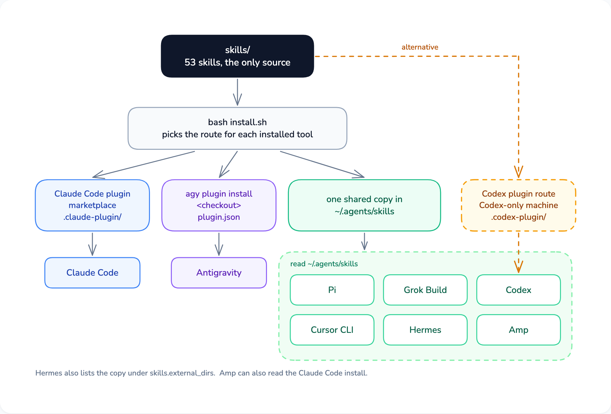
</p>

### 1. Get the code

```bash
git clone https://github.com/Ninety2UA/agent-blueprint.git
cd agent-blueprint
```

### 2. Install for the tools you use

The installer finds the tools on your `PATH` and gives each one its route:

```bash
bash install.sh
```

Or install one tool at a time with its own route (`<checkout>` is the folder you cloned):

| Tool | Command | Install route | Support note |
|---|---|---|---|
| Claude Code | `claude` | `claude plugin marketplace add Ninety2UA/agent-blueprint`, then `claude plugin install agent-blueprint@agent-blueprint` | [claude-code.md](docs/hosts/claude-code.md) |
| Codex | `codex` | `bash install.sh --only codex` (the shared copy). On a machine where no other tool uses the shared copy, `codex plugin marketplace add <checkout>` then `codex plugin add agent-blueprint@agent-blueprint` instead; never both | [codex.md](docs/hosts/codex.md) |
| Antigravity | `agy` | `agy plugin install <checkout>`, or `bash install.sh --only agy` | [antigravity.md](docs/hosts/antigravity.md) |
| Grok Build | `grok` | `bash install.sh --only grok` (the shared copy) | [grok-build.md](docs/hosts/grok-build.md) |
| Pi | `pi` | `bash install.sh --only pi` (the shared copy) | [pi.md](docs/hosts/pi.md) |
| Cursor CLI | `cursor-agent` | `bash install.sh --only cursor-agent` (the shared copy) | [cursor-cli.md](docs/hosts/cursor-cli.md) |
| Hermes | `hermes` | `bash install.sh --only hermes`, then add `~/.agents/skills` under `skills.external_dirs` in `~/.hermes/config.yaml` (the installer prints the lines) | [hermes.md](docs/hosts/hermes.md) |
| Amp | `amp` | `bash install.sh --only amp`, or nothing if Claude Code already has the plugin, because Amp reads Claude Code's install | [amp.md](docs/hosts/amp.md) |

The shared copy is one copy of `skills/` in `~/.agents/skills`, read by Codex, Grok Build, Pi, Cursor CLI, Hermes and Amp. The installer records it in `~/.agents/skills/.agent-blueprint-install.json`, so running it again removes skills that were renamed or dropped since. Cursor CLI and Amp also read Claude Code's plugin, so on a machine with Claude Code and either of them the installer writes no shared copy: Codex gets its own plugin, Grok Build, Pi and Hermes each get a copy in their own skills folder (`~/.grok/skills`, `~/.pi/agent/skills`, `~/.hermes/skills`), and a shared copy an earlier install left is removed. Keep one route per tool: a tool that sees the skills twice lists every skill twice, Codex with both its plugin and the shared copy for one. The support note for each tool says what to check before adding a route.

Installer options:

```bash
bash install.sh --dry-run                    # print what would run or be copied, change nothing
bash install.sh --only claude,codex          # only these tools (claude,codex,agy,grok,pi,cursor-agent,hermes,amp)
bash install.sh /path/to/project             # install, then scaffold that project
bash install.sh --scaffold /path/to/project  # only scaffold a project's files
bash install.sh --copy-dir /path/to/skills   # copy the skills somewhere else, for a machine with no tool on PATH
```

### 3. Check that your tool sees the skills

Start a session and ask which skills it has that start with `ab-`. You should see them listed; the support note for your tool names its own listing command. Two skills, `ab-plugin-update` and `ab-migrate`, are manual-only and stay out of that list on purpose: they run only when you name them.

### 4. Name a skill when you want a specific one

Every tool also picks a skill on its own when your request matches its description.

| Tool | How to name a skill |
|---|---|
| Claude Code, Antigravity, Grok Build, Cursor CLI, Hermes | `/` followed by the skill name, for example `/ab-brainstorming` |
| Codex | `$` followed by the skill name, for example `$ab-brainstorming` |
| Pi | `/skill:` followed by the skill name |
| Amp | Ask in plain words: "use the ab-brainstorming skill" (Amp removed user invocation of skills in May 2026) |

What each tool supports:

| Tool | Hooks | Helpers | Manual-only skills |
|---|---|---|---|
| Claude Code | 10 handlers | Subagents, worktree isolation | Kept out of the model's list |
| Codex | 5 handlers with the plugin route, after you trust them in `/hooks`; none with the shared copy | Subagents, file ownership | Kept out of the model's list |
| Antigravity | None | Subagents, worktree isolation | Kept out of the model's list (smoke test on 1.2.16) |
| Grok Build | None | Subagents, worktree isolation | Kept out of the model's list |
| Pi | None | With the `pi-subagents` package; inline without it | Kept out of the model's list |
| Cursor CLI | None | Subagents, worktree isolation | Kept out of the model's list |
| Hermes | None | Subagents (`delegate_task`), two per one-shot run | Cannot be enforced |
| Amp | None | Subagents, file ownership | Cannot be enforced |

## Quick start

1. Install the blueprint for your tool, as described in [Install](#install).
2. Set up a project. Open a session in your project and ask for the `ab-project-start` skill. It adds `AGENTS.md` (with a one-line `CLAUDE.md` that imports it), `docs/context/`, `BACKLOG.md` and `.agent-blueprint/.gitignore`, merging into what is already there, then fills in conventions, goals and status from your code and a short conversation. To add only the files, without a session:

   ```bash
   bash install.sh --scaffold /path/to/your/project
   ```

3. Design your first feature. Ask for the `ab-brainstorming` skill with your idea. It checks what the repository already answers, compares two or three approaches, asks you to approve a design, and saves a plan under `docs/plans/`. Read the plan before anything runs, because it holds the details the design left open.
4. Build it, choosing how much you want to watch:
   - `ab-build-pipeline` runs the plan with a checkpoint after every stage.
   - `ab-ship-pipeline` runs it end to end with no checkpoints.
   - `ab-orchestrate` runs it as team work, in parallel waves.
5. Take the short path for small changes. A bug fix with an obvious cause, a typo, a config change or a test for existing behavior, touching under three files, goes through `ab-quick-fix`: a failing test, the fix, the whole test suite, a commit.
6. Hand over to the next session. Ask for `ab-session-wrap` at the end. It updates `docs/context/STATUS.md` from git history and the file system. Next time, `ab-resume-session` reads it back and tells you whether anything moved in between.

## Unattended runs

<p align="center">
  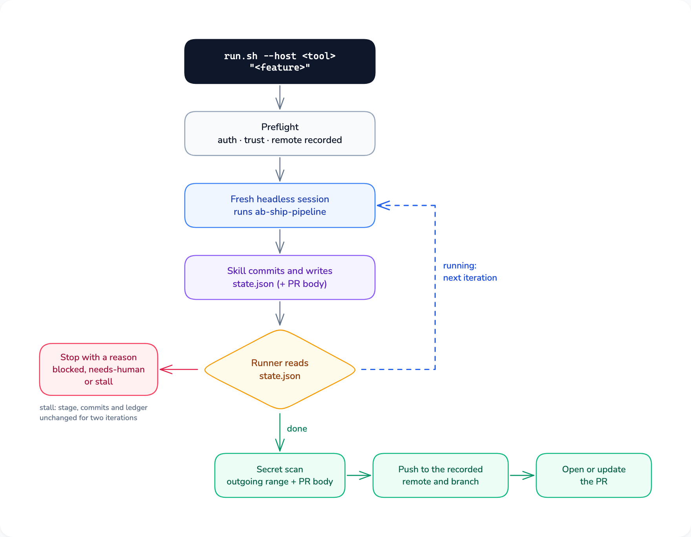
</p>

For a well-defined feature you want built hands-off, the ship runner drives `ab-ship-pipeline` through your tool's headless mode. Inside a session you can also ask for the skill with the feature; the runner is for running it from a terminal, without you.

### Start a run

1. Create a feature branch and make sure the working tree is clean. The runner refuses to run on the default branch, and needs git 2.29 or newer to work out what a push would publish.

   ```bash
   git switch -c feat/jwt-refresh
   ```

2. Start the runner with your tool and the feature. `--host` is one of `claude`, `codex`, `agy`, `grok`, `pi`, `cursor-agent`, `hermes`, `amp`; add `--dry-run` first to see the preflight and the command it would run without changing anything.

   ```bash
   bash <checkout>/skills/ab-ship-pipeline/scripts/run.sh --host codex "add JWT authentication with refresh tokens"
   ```

### What the runner does

1. Preflight. It checks that the tool is installed and signed in, records the remote and branch it will push to, and probes whether the tool's headless posture can write to `.git`. Where it cannot (Codex `workspace-write`), the skill leaves its work uncommitted with the message in `.agent-blueprint/run/commit-msg.md`, and the runner commits after each iteration.
2. The loop. Every iteration is a new headless session with a clean context. The skill locks the requirements as decisions, writes and verifies a plan, deepens it with research, builds it through `ab-orchestrate`, reviews and fixes until no P1 finding is left (three rounds at most by default), records what it learned, commits, and writes the pull request body. Between iterations the runner reads `.agent-blueprint/run/state.json`.
3. The finish check. Text the agent prints never ends a run. It is done only when the state file says `done`, there are new commits since the recorded base, the pull request body exists, and the provenance record names the skill and its version.
4. Publishing. The runner scans every commit the push would publish (each one the remote does not have yet, plus the run's own), their messages and the pull request body for secrets, including any `.env` file a commit added. Then it pushes exactly the commit it scanned, only to the remote and branch it recorded, and opens or updates the pull request. It stops as `needs-human` instead if it cannot read the remote's branches, if the git configuration (any file git reads, `.git/config` included) or the place a push would go changed during the run, or if those commits touch `.github/workflows` or `.github/actions` and you did not pass `--allow-ci-changes`.

### When a run stops early

When the skill stops the run, it sets `blocked` or `needs-human` in `.agent-blueprint/run/state.json` and writes its `reason` there. When the runner stops it on one of its own checks (preflight, the stall rule, repeated tool errors, a publish check or the `--max` iteration limit), the runner prints the reason in the terminal and sets its exit code, and `state.json` may still say `running` or `done`. The stall rule ends a run as `blocked` when the stage, the commits and the team ledger stay unchanged for two iterations. The exit codes are 0 published, 1 usage or preflight, 2 blocked, 3 needs-human, 4 iteration limit and 130 interrupted.

For an unattended run, keep the runner's output, for example by redirecting it to a file. The runner logs what the tool printed in each iteration under `${XDG_STATE_HOME:-~/.local/state}/agent-blueprint/<repo hash>/logs/`, outside the working tree, but its own stop messages go only to the terminal. Fix the reported cause and continue with `--resume`. When that is not enough, the `ab-forensics` skill reads the run's logs, state and git history.

### How much each tool is allowed to do

Each tool runs with the least privilege that still finishes a run: Claude Code `--permission-mode auto`, Codex `workspace-write` with network on, Cursor CLI `--force --sandbox enabled`, Grok Build `--always-approve --sandbox workspace`. Pi, Amp and Antigravity can only run unguarded (`--dangerously-skip-permissions` or the equivalent), so the runner asks for `--allow-unguarded` before it starts one of them. On those tools the agent holds your git and `gh` credentials, and the runner's publish checks cannot contain it.

## Upgrade from v3

1. Install v4 for your tools, as described in [Install](#install). In Claude Code the new plugin is `agent-blueprint@agent-blueprint`; the old `claude-code-blueprint@claude-code-blueprint` stays installed until step 3, and the v4 session-start hook reminds you until then. `install.sh --legacy`, which copied v3 into a project's `.claude/`, is retired and points you at `ab-migrate`.
2. Clean each project with `ab-migrate`. Open a session in a project that used v3 and name the skill (it is manual-only). It lists what v3 left there: in-project copies of skills, agents and hooks, `scripts/ship.sh`, ship state under `.claude/`, and a `CLAUDE.md` that should become `AGENTS.md`. It asks once, removes only the files the blueprint installed, behind a `blueprint-v3-backup` branch, and makes no commit, so you review the diff and commit it yourself.
3. Remove the v3 plugin once no project needs the old skills:

   ```bash
   claude plugin uninstall claude-code-blueprint@claude-code-blueprint
   claude plugin marketplace remove claude-code-blueprint
   ```

4. Refresh the project files. Run `ab-project-start` in the migrated project. It adds the v4 files the project lacks and keeps every section your `AGENTS.md` already has.
5. Use the new names. `/build-pipeline` is now `ab-build-pipeline`, and the other skills gained the same prefix. The exceptions are `agent-teams` and `team-execution`, which merged into `ab-orchestrate`, and `migrate-to-plugin`, which became `ab-migrate`. The full map, the folder changes and what happened to each v3 instruction rule are in [`docs/upgrade/v4.md`](docs/upgrade/v4.md).

## Update

| Install route | How to update |
|---|---|
| Claude Code plugin | `claude plugin marketplace update agent-blueprint`, then `claude plugin update agent-blueprint@agent-blueprint`, then `/reload-plugins` |
| Codex plugin | `codex plugin` from the marketplace you added; the `ab-plugin-update` skill finds the right subcommand, or falls back to the shared copy |
| Antigravity | `git pull` in the checkout, then `agy plugin install <checkout>` again |
| The shared copy (Codex, Grok Build, Pi, Cursor CLI, Hermes, Amp) | `git pull` in the checkout, then `bash install.sh` again |

In any tool, the `ab-plugin-update` skill works out which route you used, runs it, and checks the installed version against `main`.

## What you get

### Project structure

```
Plugin (installed in your tool, zero files in your project)
├── 53 skills            skills/<name>/SKILL.md with references/ (prompt files, procedures) and optional scripts/ and assets/
│                        ab-build-pipeline, ab-ship-pipeline, ab-brainstorming, ab-review-swarm, ab-orchestrate, ab-migrate, ...
├── 30 helper prompts    skills/<skill>/references/agents/<name>.md: a helper runs it where the tool has subagents, the session follows it where not
└── 10 hooks             hooks/claude-code.json (session-start, prompt-guard, validate-commit, sdd-cache pre and post, context-monitor,
                         read-injection-scanner, ship-loop, task-completed, teammate-idle) and hooks/codex.json (five of them)

your-project/ (scaffolded by ab-project-start)
├── AGENTS.md              # Project instructions; every tool reads it
├── CLAUDE.md              # One line, @AGENTS.md, so Claude Code loads the same file
├── BACKLOG.md             # Idea and bug capture inbox
├── blueprint.local.md     # Per-developer helper configuration (gitignored)
├── .agent-blueprint/      # The blueprint's working files; run/ and team/ are ignored, plans and notes are tracked
├── docs/
│   ├── context/           # STATUS.md (session continuity), GOALS.md, CONVENTIONS.md, DECISIONS.md
│   ├── plans/             # Implementation plans
│   ├── specs/             # Feature specifications
│   ├── decisions/         # Architecture decision records
│   ├── research/          # Spike results and evaluations
│   ├── learnings/         # LEARNINGS.md: patterns and gotchas learned here
│   └── solutions/         # Solved problems, written by ab-knowledge-compounding
├── src/                   # Your application code
├── tests/                 # Your test suite
└── infra/                 # Deployment and infrastructure
```

### What each piece does

| Component | Purpose |
|-----------|---------|
| AGENTS.md | The project instructions every tool loads: how work is done here and why, where things are, when to decide and when to ask. `CLAUDE.md` imports it for Claude Code. |
| Skills | Workflow steps that run at specific points: brainstorming, planning, test-driven development, debugging, review, team work, shipping, knowledge capture. Each is a folder with a `SKILL.md` under 8,000 bytes and its detail in `references/`. |
| Helper prompts | Prompt files for focused analysis (security, performance, architecture, research, plan checking) inside the skill that uses them. A helper runs one in its own context where the tool has subagents; otherwise the session follows the file itself. Both return the same output. |
| Hooks | Optional guards for Claude Code and Codex: a session-start pointer to `STATUS.md`, injection scanners, a commit-message check, the ship-pipeline Stop guard, the Agent Teams gates. No pipeline depends on them. |
| docs/context/ | Living project state: goals, status with the Session Continuity notes, conventions, locked decisions. `ab-session-wrap` updates it every session. |
| docs/solutions/ | Solved problems written by `ab-knowledge-compounding`, searched by `ab-brainstorming` and `ab-deep-research` before new work. |
| .agent-blueprint/ | Working files: run state, the team ledger, review runs, debug notes, plans in progress. Its own `.gitignore` keeps run state out of commits. |
| BACKLOG.md | Quick-capture inbox for ideas, bugs and tasks, sorted by `ab-backlog-triage` into prioritized work. |
| blueprint.local.md | Each developer's choice of which review and research helpers run for this stack. Gitignored. |

## Workflow

### The development loop

Every feature follows this flow:

<p align="center">
  
</p>

1. Orient. Load context with `ab-project-status` or `ab-resume-session`, or set up with `ab-project-start`.
2. Ideate (optional). `ab-ideation` reads the codebase, the learnings and the git history and ranks improvement ideas.
3. Design. `ab-brainstorming` lays out the tradeoffs and gets your approval before any code is written.
4. Plan. The approved design becomes tasks that record decisions, not code: file paths, each test and what it asserts, signatures, and a review focus list. You review the saved plan. Then deepen it with research (`ab-deepen-plan`), run it one task at a time (`ab-subagent-driven-development` or `ab-executing-plans`), or run it as team work (`ab-orchestrate`).
5. Build. Test-driven development, verification with evidence, and a review from a helper.
6. Ship. Merge the branch, update the project docs with `ab-session-wrap`, and record what was learned for the next session.

### Lightweight workflow for small changes

Bug fixes with an obvious cause, typos, config changes and tests for existing behavior take the short path, `ab-quick-fix`:

<p align="center">
  
</p>

The boundary is three files: a change that touches three or more files, adds an API or changes a data model goes through `ab-brainstorming` and then `ab-build-pipeline`. The scaffolded `AGENTS.md` states the same rule.

### Autonomous pipeline: `ab-ship-pipeline`

<p align="center">
  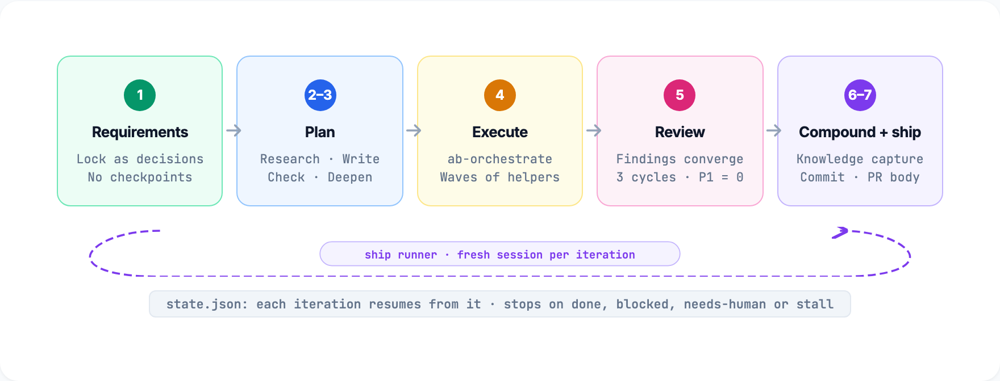
</p>

`ab-ship-pipeline` runs the whole lifecycle without checkpoints: it locks assumptions as decisions, writes and verifies a plan, deepens it, builds it through `ab-orchestrate`, reviews until the findings converge, records what it learned, then commits and writes the pull request body. It tracks itself in `.agent-blueprint/run/state.json` and stops as `blocked` or `needs-human`, with a reason, when it cannot finish. Run it in a session by naming the skill, or unattended through the ship runner described in [Unattended runs](#unattended-runs).

### Quality gates

<p align="center">
  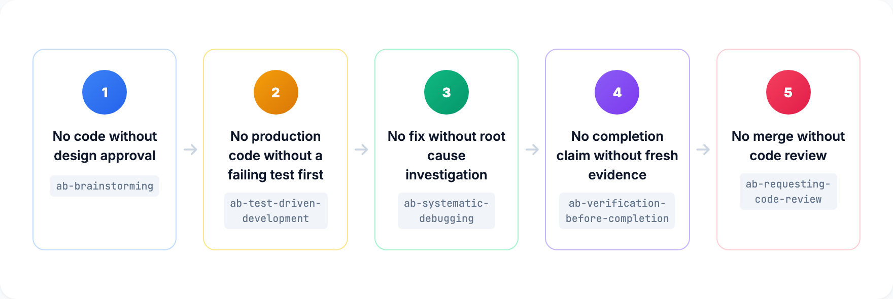
</p>

Five checkpoints hold at every stage:

| Gate | Rule | Enforced by |
|------|------|-------------|
| 1 | No code without design approval | `ab-brainstorming` |
| 2 | No production code without a failing test first | `ab-test-driven-development` |
| 3 | No fix without a root cause investigation | `ab-systematic-debugging` |
| 4 | No completion claim without fresh verification evidence | `ab-verification-before-completion` |
| 5 | No merge without code review | `ab-requesting-code-review` |

### Consistency gates (CI)

The repository checks itself against its own files, not against numbers someone typed. CI runs every gate on every pull request, and `AGENTS.md` lists them for maintainers.

| Command | Checks |
|---------|--------|
| `bash scripts/check-drift.sh` | Count and version claims in the manifests, the README, `AGENTS.md`, `index.html` and the README hero's source in `site/motion/readme-hero/` match the tree: 53 skills, 10 hooks, 30 helper prompts, one version. The site source in `site/src/` and the other motion sources in `site/motion/` state no literal skill, helper or hook count, and every skill sits in exactly one README phase table. It also fails when README.md, index.html or the site source brings back adoption or ecosystem wording |
| `npx astro check` (in `site/`) | Type errors in the site's `.astro` and TypeScript files, under Astro's strict settings. Run it after `npm ci` in `site/` |
| `python3 scripts/check-site.py site/dist` | The built site against the tree: one page per skill, each helper prompt once on the Skills page, the counts and version the pages state, no `SKILL.md` in the build, no adoption or ecosystem wording, internal links that resolve, and a title, description and canonical link on every page. Build the site first with `npm ci` and `npm run build` in `site/`, which needs Node 22.12 or later |
| `node --test 'site/test/**/*.test.mjs'` | The site's data modules against the tree, such as the README, SKILL.md, release and tutorial parsers, each section's page order and llms.txt. On the built pages: a title and description of their own, the sitemap, the Changelog and Kit pages, islands that hydrate only on first interaction, and no script or stylesheet from another origin. Run it from the repository root with the glob quoted, after the site build: without `site/dist` the built-page tests skip |
| `python3 scripts/check-skill-collisions.py` | Frontmatter YAML, `references/` pointers and § headings resolve, no near-duplicate descriptions |
| `python3 scripts/check-portability.py` | The rules for all eight tools: agentskills frontmatter only, the `ab-` prefix, the 8,000-byte cap, no tool variables or cross-skill paths, no slash names, the manual-only pairing, no text Hermes would quarantine |
| `python3 scripts/check-manifests.py` | Every manifest and every skill's `metadata.version` agree with the release |
| `python3 scripts/sync-shared.py --check` | Shared snippets and prompt copies match their sources |
| `python3 -m unittest discover -s tests/gates` | The gate and skill-contract tests |
| `claude plugin validate --strict .claude-plugin/plugin.json` | The plugin manifest, with Claude Code's own validator |

The ship runner has its own tests under `tests/runner/`, which drive `run.sh` against a fake tool. The smoke test in `tests/smoke/` runs outside CI because it needs the real tools and their accounts: before a release, it runs a sample project through the main pipelines in every installed tool's headless mode and writes a pass/fail table per tool. A tool that fails only because of a vendor bug ships marked degraded in its support note, with a link to the upstream issue; a failure in the blueprint's own code blocks the release.

## Team work and swarms

Helpers run one at a time or in coordinated groups. The same patterns work in every tool: a helper runs where the tool has subagents, and the session does the work itself where it does not.

### Team work (`ab-orchestrate`)

`ab-orchestrate` runs a plan as a team, with your session as the lead. The lead keeps a task ledger in `.agent-blueprint/team/<run>/`, groups the tasks into waves by dependency (tasks that share a file never share a wave), and starts one helper per task, each owning its files or working in its own worktree. Only the lead commits: it integrates each finished task, commits it, and runs an integration check between waves. A wave has four tasks by default and never more than the tool's helper limit in `skills/ab-orchestrate/references/host-limits.tsv` (Claude Code 20, Codex 4, Pi 4 with `pi-subagents`, Hermes 3 interactive and 2 one-shot; Antigravity, Grok Build, Cursor CLI and Amp document no limit). A run can resume from the ledger in another session or another tool.

<p align="center">
  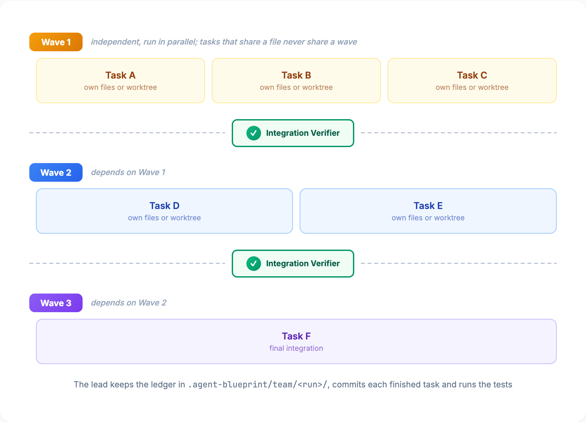
</p>

If you have switched on a native team feature, the lead uses it on top of the ledger, as `skills/ab-orchestrate/references/native-extras.md` describes: Claude Code Agent Teams (`CLAUDE_CODE_EXPERIMENTAL_AGENT_TEAMS=1`, interactive sessions only, with the blueprint's TeammateIdle and TaskCompleted hooks) and Codex `multi_agent_v2` (`multi_agent_v2 = true` under `[features]`, long-lived helpers that take follow-up tasks). The ledger stays the task list either way.

<p align="center">
  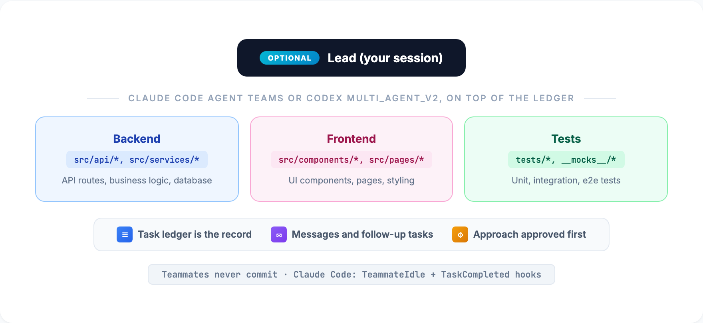
</p>

### Review swarm (`ab-review-swarm`)

Reviews a change with specialized reviewers in parallel: quality, simplicity and tests every time; security, performance, conventions, frontend, architecture, data and schema when the diff calls for them. A validator re-checks the findings, and a synthesizer merges them into one prioritized P1/P2/P3 report.

<p align="center">
  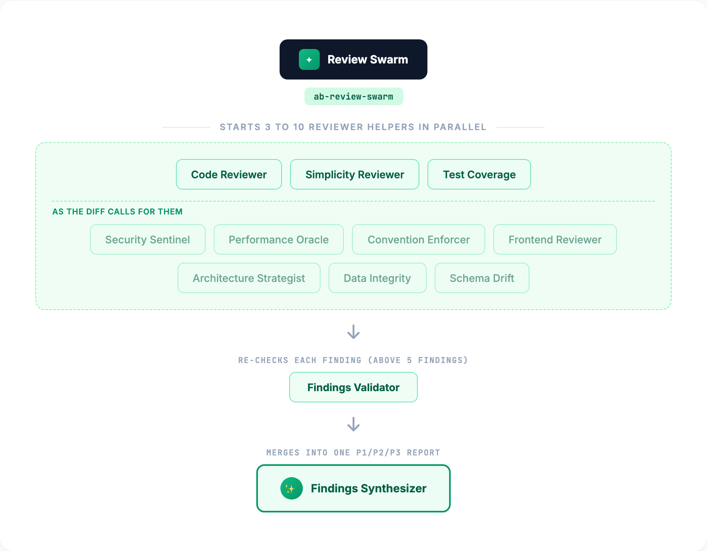
</p>

### Research swarm (`ab-deep-research`)

Five helpers research a topic in parallel before planning: past learnings, framework docs for the installed versions, industry practice, git history, and a map of the code the change touches. A synthesizer turns their findings into one brief.

<p align="center">
  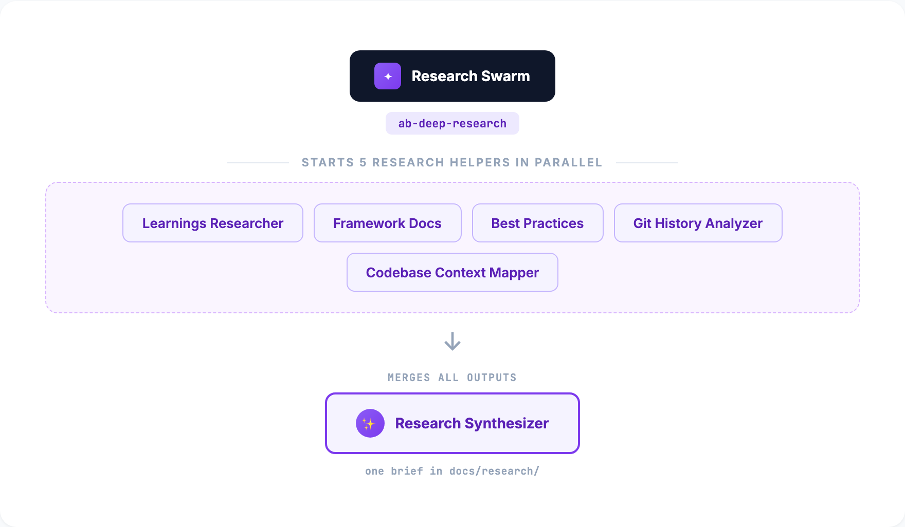
</p>

### Knowledge loop (`ab-knowledge-compounding`)

Each solved problem becomes a searchable document in `docs/solutions/`, which `ab-brainstorming` and `ab-deep-research` search before new work.

<p align="center">
  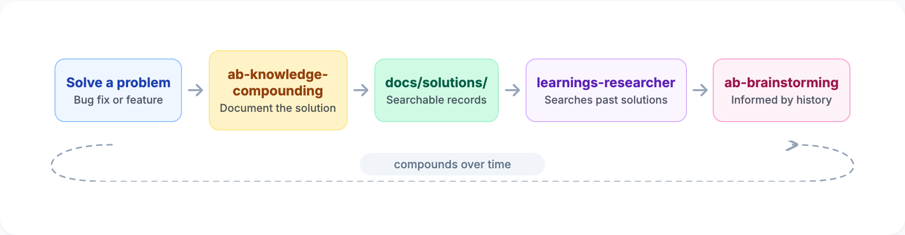
</p>

### Swarms or team work

| Pattern | Best for | How it works |
|---------|----------|-------------|
| Swarms (`ab-review-swarm`, `ab-deep-research`) | Analysis: the same input through different lenses | Read-only helpers; a synthesizer merges the outputs |
| Team work (`ab-orchestrate`) | Implementing a plan's tasks | Task ledger, waves, file ownership or worktrees, lead-only commits |

A typical feature combines them: `ab-deep-research`, then `ab-brainstorming`, then `ab-orchestrate`, then `ab-review-swarm`.

## Model and effort

The blueprint never picks a model or an effort level for you, in any tool. No skill or helper prompt sets either one, so a pipeline reasons at whatever level your session runs, and a helper inherits that choice wherever the tool passes it on. A prompt whose role header says it is safe at lower effort may run lower only where the tool takes a per-helper effort and you have not asked for your level everywhere. The blueprint never switches models to save effort.

| Tool | Set the model | Set the effort | Do helpers inherit them? |
|---|---|---|---|
| Claude Code | `/model` in a session, or `claude --model <model>` | `/effort`, `claude --effort <level>`, or `CLAUDE_CODE_EFFORT_LEVEL`; a level saved in settings applies below those | Yes: a helper without an effort of its own inherits the session level; verified on 2.1.284 |
| Codex | `/model` in a session, or `codex -m <model>` | `model_reasoning_effort` in `~/.codex/config.toml` (`low` to `ultra`, by model) | Yes: a subagent inherits the parent's model and effort unless configured otherwise, and `spawn_agent` can set effort per helper |
| Antigravity | `/model` in a session (saved), or `agy --model <model>`; `agy models` lists them | `agy --effort low\|medium\|high\|xhigh\|max` | Not verified: a subagent definition can set a model tier, and no per-dispatch override is documented |
| Grok Build | `/model`, `grok -m <model>`, or `[models] default` in `~/.grok/config.toml` | `--effort none\|minimal\|low\|medium\|high\|xhigh\|max` | Not verified: per-dispatch model and effort are not documented |
| Pi | `/model`, or `pi --model <pattern>[:thinking]` | `/thinking`, or `--thinking off\|minimal\|low\|medium\|high\|xhigh\|max` (clamped to the model) | Only with the `pi-subagents` package, which takes a per-dispatch `model:"provider/id:level"`; inheritance not verified |
| Cursor CLI | `/model` picker, or `cursor-agent --model 'id[effort=high]'` | Inside the model string: `id[effort=high]`; there is no separate effort flag | Helpers defined in agent files can say `model: inherit`; for the blueprint's helpers, not verified |
| Hermes | `/model` in a session, or `hermes -m <model> --provider <provider>` | `/reasoning high` in a session, or `agent.reasoning_effort` in `~/.hermes/config.yaml` | No: helpers use the global `delegation.model` and `delegation.reasoning_effort` settings |
| Amp | The Dial: a mode (`low`, `medium`, `high`, `ultra`) sets model, effort, prompt and tools together, chosen before the first message and fixed for the thread | Part of the mode | Not verified: a prompt cannot pick a model per helper |

### Claude Code specifics

Opus 5.5 is the default model on every plan from CLI 2.1.280 and starts sessions at `medium` effort; other current models start at `high`. A level set with `--effort`, `/effort` or the environment variable wins over settings, and settings win over the model default. Some reference points:

| Session setting | Fits |
|-----------------|------|
| Opus 5.5 at `high` | A solid default for pipeline runs |
| Opus 5.5 at `xhigh`, or Fable 5.1 at `high` | Hard or high-stakes work; slower and costlier |
| Opus 5.5 at `medium` (its starting level) or lower | Small tasks, quick fixes and questions |

The ship runner passes no model or effort flag of its own, so an unattended run uses the defaults you saved in the tool.

## Skills reference

<p align="center">
  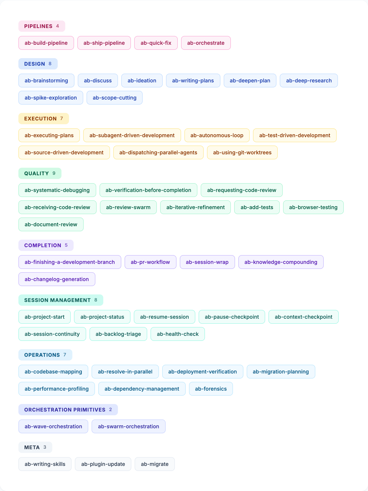
</p>

Each skill is a folder under `skills/` with a `SKILL.md` that stays under 8,000 bytes and a `references/` folder with the detail it loads at the point of use.

### Pipelines

| Skill | What it does | When |
|-------|-------------|------|
| [ab-build-pipeline](skills/ab-build-pipeline/) | Runs a feature through eight supervised stages (discuss, brainstorm, plan, execute, review, verify, optional deploy check, knowledge capture) with a checkpoint after each | A feature you approve stage by stage |
| [ab-ship-pipeline](skills/ab-ship-pipeline/) | Ships a feature end to end with no checkpoints, tracked in `.agent-blueprint/run/state.json`; the ship runner drives it unattended | A well-defined feature you want built hands-off |
| [ab-quick-fix](skills/ab-quick-fix/) | A small, well-understood change through a short test-first loop, then a commit on a branch | Under three files, obvious approach |
| [ab-orchestrate](skills/ab-orchestrate/) | Runs a plan as team work: ledger, dependency-ordered waves, file ownership or worktrees, lead-only commits, review and sign-off | Four or more tasks, some independent |

### Design phase

| Skill | What it does | When |
|-------|-------------|------|
| [ab-brainstorming](skills/ab-brainstorming/) | Turns an idea into an approved design: settles what the repository answers, challenges the premise, compares two or three approaches, saves the plan | Before any new feature |
| [ab-discuss](skills/ab-discuss/) | Captures and locks your decisions before planning, with prior art from ADRs, plans and learnings | Ambiguous choices ahead of a plan |
| [ab-ideation](skills/ab-ideation/) | Generates grounded improvement ideas from learnings, structure and git history, and saves five to seven ranked survivors | "What's worth building?" |
| [ab-writing-plans](skills/ab-writing-plans/) | Turns an approved design into a plan that records decisions, not code: file paths, each test and what it asserts, signatures, verification commands, review focus | After design approval |
| [ab-deepen-plan](skills/ab-deepen-plan/) | Enriches a plan with five read-only research helpers in parallel; findings go under each section as research notes | A plan that needs more evidence |
| [ab-deep-research](skills/ab-deep-research/) | Researches a topic with five helpers in parallel and writes one synthesized brief | Before planning something unfamiliar |
| [ab-spike-exploration](skills/ab-spike-exploration/) | A timeboxed, hands-on spike with throwaway code that answers one technical question, reported to `docs/research/` | Significant technical uncertainty |
| [ab-scope-cutting](skills/ab-scope-cutting/) | Cuts a feature to the smallest useful deliverable with MoSCoW and checks the must-haves still ship | Feature too large or deadline at risk |

### Execution phase

| Skill | What it does | When |
|-------|-------------|------|
| [ab-executing-plans](skills/ab-executing-plans/) | Executes a plan in batches of three tasks with a checkpoint after each batch and a whole-branch review at the end | Plan execution in this session |
| [ab-subagent-driven-development](skills/ab-subagent-driven-development/) | A fresh helper per task, then a spec reviewer and a code reviewer, with fix rounds until both pass | Plan execution with two-stage review |
| [ab-autonomous-loop](skills/ab-autonomous-loop/) | Runs a plan's tasks with no checkpoints: verify, tick, commit, retry after a written reflection, stop on a circuit breaker or a risk score | "Just do it all" |
| [ab-test-driven-development](skills/ab-test-driven-development/) | Red, green, refactor: one failing test, the least code that passes, the whole suite, then refactor | Any new code |
| [ab-source-driven-development](skills/ab-source-driven-development/) | Writes framework- and library-specific code from the official docs for the installed version, citing the URL or marking it unverified | Framework or library APIs |
| [ab-dispatching-parallel-agents](skills/ab-dispatching-parallel-agents/) | One focused helper per independent problem, all started at once, then integrated | Two or more unrelated failures |
| [ab-using-git-worktrees](skills/ab-using-git-worktrees/) | An isolated git worktree on a new branch for feature or parallel work | Before major features |

### Quality phase

| Skill | What it does | When |
|-------|-------------|------|
| [ab-systematic-debugging](skills/ab-systematic-debugging/) | Root cause before any fix: classify, reproduce, trace, one hypothesis at a time against evidence tiers, fix test-first | Any bug or test failure |
| [ab-verification-before-completion](skills/ab-verification-before-completion/) | Fresh evidence before any completion claim: the output that would prove it false, the full command, its exit code | Before saying work is done |
| [ab-requesting-code-review](skills/ab-requesting-code-review/) | A fast single-reviewer review of a guarded range with the code-reviewer helper | After a task or before a merge |
| [ab-receiving-code-review](skills/ab-receiving-code-review/) | Acts on review feedback by verifying each item first, then one change at a time with a test, or a technical pushback | When review feedback arrives |
| [ab-review-swarm](skills/ab-review-swarm/) | Specialized reviewers in parallel, findings validated and merged into one P1/P2/P3 report | Significant changes |
| [ab-iterative-refinement](skills/ab-iterative-refinement/) | Review, fix and review again until the findings converge (fast, deep or perfect) | Ship pipeline reviews, `ab-build-pipeline --iterate N` |
| [ab-add-tests](skills/ab-add-tests/) | Backfills tests for code that has none, ranked by risk, with you choosing which gaps to fill | Improving coverage |
| [ab-browser-testing](skills/ab-browser-testing/) | Verifies UI changes in a real browser through a browser automation tool, including error states and viewports | After UI changes |
| [ab-document-review](skills/ab-document-review/) | Three-pass review of a document (accuracy against the repository, clarity, completeness) with a verdict | Specs, plans, READMEs, runbooks |

### Completion phase

| Skill | What it does | When |
|-------|-------------|------|
| [ab-finishing-a-development-branch](skills/ab-finishing-a-development-branch/) | Tests, a plan audit against the diff, then merge locally, push and open a PR, or keep the branch; discards only on request | After all tests pass |
| [ab-pr-workflow](skills/ab-pr-workflow/) | The pull request lifecycle: checks on the pushed commit, a body that states the motivation and is scanned for secrets, self-review, comment resolution, merge onto a green main | Creating or finishing a PR |
| [ab-session-wrap](skills/ab-session-wrap/) | Ends a session from git history and the file system: rewrites the Session Continuity notes in `docs/context/STATUS.md`, records learnings, updates the docs | End of a session |
| [ab-knowledge-compounding](skills/ab-knowledge-compounding/) | Records a solved problem in `docs/solutions/` with search terms and cross-links | After a non-trivial problem |
| [ab-changelog-generation](skills/ab-changelog-generation/) | Release notes from git history in Keep a Changelog format | Preparing a release |

### Session management

| Skill | What it does | When |
|-------|-------------|------|
| [ab-project-start](skills/ab-project-start/) | Scaffolds `AGENTS.md`, `CLAUDE.md`, `docs/context/` and `BACKLOG.md` by merging, then fills in conventions, goals and status | New project, or adding the blueprint to one |
| [ab-project-status](skills/ab-project-status/) | Where the project stands: code state, work in flight, goal progress, top three next actions | Start of a session |
| [ab-resume-session](skills/ab-resume-session/) | Reloads what earlier sessions left and checks whether HEAD moved since the handoff | Picking up earlier work |
| [ab-pause-checkpoint](skills/ab-pause-checkpoint/) | A quick mid-session snapshot plus the execution state in `docs/context/STATE.md` | Stepping away |
| [ab-context-checkpoint](skills/ab-context-checkpoint/) | A timestamped recovery point with progress, decisions, next steps and open questions | Before risky operations or a long session |
| [ab-session-continuity](skills/ab-session-continuity/) | Keeps `docs/context/STATE.md` current across session boundaries with a HEAD stamp | During wave orchestration |
| [ab-backlog-triage](skills/ab-backlog-triage/) | Sorts the `BACKLOG.md` inbox into prioritized, typed items against the goals | When the inbox grows |
| [ab-health-check](skills/ab-health-check/) | Eight areas (build, tests, lint, dependencies, conventions, docs, backlog, git) checked with the project's own commands | Periodic check |

### Operations

| Skill | What it does | When |
|-------|-------------|------|
| [ab-codebase-mapping](skills/ab-codebase-mapping/) | Maps an unfamiliar codebase, read-only, into structured documentation with file paths | Before modifying unfamiliar code |
| [ab-resolve-in-parallel](skills/ab-resolve-in-parallel/) | Fixes a batch of independent items at once, one helper per item, then checks for conflicts | PR comments, review findings, test failures |
| [ab-deployment-verification](skills/ab-deployment-verification/) | A go/no-go check across eight areas with concrete evidence | Before a production deployment |
| [ab-migration-planning](skills/ab-migration-planning/) | A migration plan where every step can be undone: blast radius, expand-contract steps, rollbacks | Database, API or dependency migrations |
| [ab-performance-profiling](skills/ab-performance-profiling/) | Measure, profile, one optimization at a time against the noise floor, reverted attempts recorded | When something is slow |
| [ab-dependency-management](skills/ab-dependency-management/) | Adds, upgrades and removes dependencies through five gates, pinned and committed with the lockfile | Dependency changes |
| [ab-forensics](skills/ab-forensics/) | Diagnoses a failed, stalled or aborted automated run after the fact from its logs, run state and git history | A ship run that did not finish |

### Orchestration primitives

| Skill | What it does | When |
|-------|-------------|------|
| [ab-wave-orchestration](skills/ab-wave-orchestration/) | Groups dependent tasks into waves of parallel helpers with an integration check between waves | Four or more tasks with mixed dependencies |
| [ab-swarm-orchestration](skills/ab-swarm-orchestration/) | Several read-only specialist helpers on the same input, one dimension each, merged by a synthesizer | Custom swarms |

### Meta

| Skill | What it does | When |
|-------|-------------|------|
| [ab-writing-skills](skills/ab-writing-skills/) | Writes, edits and tests skills that load in every supported tool: agentskills frontmatter, the 8,000-byte cap, capability snippets, prompt files, a test first | Creating or changing skills |
| [ab-plugin-update](skills/ab-plugin-update/) | Upgrades Agent Blueprint itself through the tool's own route or a new run of `install.sh`, then checks the version. Manual-only | Upgrading the blueprint |
| [ab-migrate](skills/ab-migrate/) | Cleans a v3 install out of a project and renames `CLAUDE.md` to `AGENTS.md` behind a backup branch. Manual-only | Moving a project from v3 |

## Helper prompts reference

Helpers are prompt files inside the skills that use them (`skills/<skill>/references/agents/<name>.md`). A skill starts a helper where the tool has subagents and follows the same file itself where it does not; either way the result comes back in the prompt's Output section. A prompt that several skills use has one source and identical copies, checked by `scripts/sync-shared.py --check`. A few long prompts keep material they need only in some runs in a companion note beside them (`<prompt>-<topic>.md`).

| Helper | Domain | When it runs |
|-------|--------|-----------------|
| [code-reviewer](skills/ab-review-swarm/references/agents/code-reviewer.md) | Standards, correctness, plan compliance | After a major step or before merge |
| [architecture-strategist](skills/ab-review-swarm/references/agents/architecture-strategist.md) | Structural patterns, service boundaries | Reviewing PRs, adding services, refactoring |
| [security-sentinel](skills/ab-review-swarm/references/agents/security-sentinel.md) | OWASP, auth flows, vulnerability scanning | Before deployment, after auth, payment or API work |
| [code-simplicity-reviewer](skills/ab-review-swarm/references/agents/code-simplicity-reviewer.md) | Unneeded code and over-engineering | After implementation is complete |
| [performance-oracle](skills/ab-review-swarm/references/agents/performance-oracle.md) | Bottlenecks, N+1 queries, algorithmic complexity | After features are built, on performance concerns |
| [best-practices-researcher](skills/ab-deep-research/references/agents/best-practices-researcher.md) | Industry standards, library documentation | When external guidance is needed |
| [git-history-analyzer](skills/ab-deep-research/references/agents/git-history-analyzer.md) | How the code evolved and why | When the reason behind code matters |
| [learnings-researcher](skills/ab-deep-research/references/agents/learnings-researcher.md) | Past solutions, decisions, patterns | Before planning: searches `docs/` for prior art |
| [plan-checker](skills/ab-deepen-plan/references/agents/plan-checker.md) | Plan validation, gap detection | After writing a plan, before execution |
| [integration-checker](skills/ab-swarm-orchestration/references/agents/integration-checker.md) | Component wiring, connection validation | After implementation: checks that components connect |
| [bug-reproduction-validator](skills/ab-systematic-debugging/references/agents/bug-reproduction-validator.md) | Bug reproduction, fix verification | When debugging: validates repro steps and fixes |
| [codebase-mapper](skills/ab-codebase-mapping/references/agents/codebase-mapper.md) | Architecture, conventions, stack analysis | Onboarding to unfamiliar code or before modifying it |
| [pr-comment-resolver](skills/ab-pr-workflow/references/agents/pr-comment-resolver.md) | Targeted PR comment resolution | Processing review feedback: one comment per helper |
| [test-gap-analyzer](skills/ab-add-tests/references/agents/test-gap-analyzer.md) | Coverage gaps, test generation | Improving coverage or before major refactors |
| [research-synthesizer](skills/ab-deep-research/references/agents/research-synthesizer.md) | Combining the research helpers' output | After parallel research |
| [deployment-verifier](skills/ab-deployment-verification/references/agents/deployment-verifier.md) | Deployment readiness | Before deploying: checks eight areas |
| [schema-drift-detector](skills/ab-review-swarm/references/agents/schema-drift-detector.md) | Unrelated schema or migration changes | Reviewing PRs: catches scope creep in the data layer |
| [frontend-reviewer](skills/ab-review-swarm/references/agents/frontend-reviewer.md) | UI code quality | Reviewing frontend code: accessibility, responsiveness, performance |
| [convention-enforcer](skills/ab-review-swarm/references/agents/convention-enforcer.md) | `CONVENTIONS.md` compliance | Reviewing code against project standards |
| [data-integrity-guardian](skills/ab-review-swarm/references/agents/data-integrity-guardian.md) | Migration safety, transactions, rollback plans | PRs with migrations, schema changes, data transforms |
| [test-coverage-reviewer](skills/ab-review-swarm/references/agents/test-coverage-reviewer.md) | Test quality, meaningful assertions, edge cases | After implementation: checks that tests validate behavior |
| [framework-docs-researcher](skills/ab-deep-research/references/agents/framework-docs-researcher.md) | Current framework docs for the installed versions | Before planning features that use specific framework APIs |
| [codebase-context-mapper](skills/ab-deep-research/references/agents/codebase-context-mapper.md) | The files and dependencies one change touches | Before planning a change |
| [integration-verifier](skills/ab-wave-orchestration/references/agents/integration-verifier.md) | Cross-task integration | After a wave: checks that parallel work fits together |
| [findings-synthesizer](skills/ab-review-swarm/references/agents/findings-synthesizer.md) | Merging review swarm output | After `ab-review-swarm`: removes duplicates and prioritizes the findings |
| [pattern-mapper](skills/ab-executing-plans/references/agents/pattern-mapper.md) | Existing files that new code should follow | Between research and execution |
| [implementer](skills/ab-subagent-driven-development/references/agents/implementer.md) | One plan task, test first, with a self-review | Subagent-driven development: a fresh helper per task |
| [spec-reviewer](skills/ab-subagent-driven-development/references/agents/spec-reviewer.md) | Built what the task asked, nothing more | Subagent-driven development: after each implementer, before code review |
| [doc-claim-verifier](skills/ab-document-review/references/agents/doc-claim-verifier.md) | Claims in docs against the codebase | Reviewing READMEs, ADRs, runbooks after a refactor |
| [findings-validator](skills/ab-review-swarm/references/agents/findings-validator.md) | Independent re-check of review findings | Between `ab-review-swarm` and synthesis: drops false positives |

### How helpers run

A helper runs in its own context where the tool can start one; otherwise the main session follows the prompt file itself. Each prompt opens with a role header (what it may change, whether it is safe at lower effort, and that it starts no helpers of its own) and ends with an Output section, so both paths return the same shape.

Single dispatch, one helper for one job:

```
Main session -> helper with references/agents/security-sentinel.md -> findings -> act on results
```

Swarm dispatch, several helpers on the same input with different lenses:

<p align="center">
  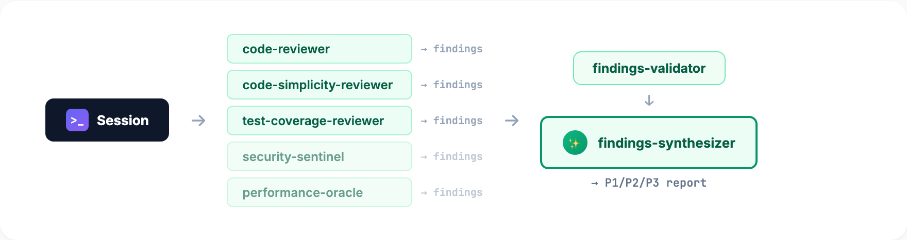
</p>

Wave dispatch, parallel within a wave and sequential between waves:

<p align="center">
  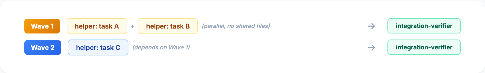
</p>

Team dispatch, with a native team feature switched on: long-lived teammates with file ownership and messaging, on top of the ledger:

<p align="center">
  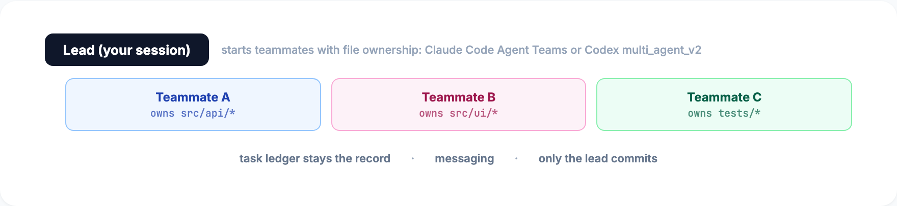
</p>

## Customization

### Adapting to your project

After installing, ask for the `ab-project-start` skill to fill in:

- `GOALS.md`: three to five project objectives with a priority each
- `CONVENTIONS.md`: the stack, the test, lint and dev commands, naming, file layout
- `STATUS.md`: the current state, known issues, recent work
- `AGENTS.md`: the instructions every tool loads; the scaffold merges its sections into an existing file and keeps yours

### Adding your own skills

The blueprint's skills are installed once. Project-specific skills live in your project's own skills folder (`.agents/skills/` for the tools that read it, or wherever your tool looks). Ask for the `ab-writing-skills` skill to write one; it holds the rules and the test-first method:

- agentskills frontmatter only (`name`, `description`, plus `argument-hint` and `disable-model-invocation`), no `model` or `effort`
- the whole `SKILL.md` under 8,000 bytes, with detail moved into `references/` at the point of use
- other skills named in prose, never with a slash, because every tool invokes skills differently
- steps that depend on the tool written with the capability snippets in `skills/ab-writing-skills/references/capability-snippets.md` (helper step, asking the user, task tracking, lower effort, working folder, provenance, no-commit mode, bundled scripts), so the skill runs in every tool
- no tool variables such as `${CLAUDE_PLUGIN_ROOT}`, no `$ARGUMENTS`, no path outside the skill's own folder

```text
> Create a skill for database migration workflows
# The ab-writing-skills skill will:
# 1. Write a failing test scenario
# 2. Create the skill
# 3. Verify it handles the scenario
```

### Adding your own helper prompts

Put a prompt file in the skill that dispatches it, under `references/agents/<name>.md`, with no frontmatter. Open it with a one-line role header (what it may change, whether it is safe at lower effort, and that it starts no helpers of its own) and end it with an `## Output` section, so a helper run and an inline run return the same shape. The skill hands work to it with the helper-step snippet. The `ab-writing-skills` skill covers the details.

### Native features in each tool

The blueprint uses a tool's native features only as opt-ins: no pipeline depends on a gated or experimental capability. Where a native feature overlaps something the blueprint does, the table says why the blueprint's own mechanism stays the default.

| Native feature | How the blueprint uses it | Requirements |
|------------------|--------------------|--------|
| Claude Code Agent Teams and Codex `multi_agent_v2` | Optional extras for `ab-orchestrate` on top of the ledger; team work runs without them in every tool | Switched on by you: `CLAUDE_CODE_EXPERIMENTAL_AGENT_TEAMS=1` (interactive sessions only) or `multi_agent_v2 = true` under `[features]` |
| Claude Code `/goal` | A complement for interactive runs; the ship runner and its state file are the guarantee, because a skill cannot invoke `/goal` and it does not run headless | None; generally available in the CLI |
| Native `/loop` and ScheduleWakeup (Claude Code) | Adds scheduled reruns, but `/loop` stays in one session and does not reset context, stop on repeated failure or notice a run getting worse, so `ab-autonomous-loop` keeps its own circuit breaker and degradation checks | None |
| Workflow tool, `/workflows`, ultracode (Claude Code) | Opt-in for very large autonomous fan-outs; wave orchestration stays the portable default | Paid plans, the API and Bedrock, Vertex or Foundry; in `claude -p` only behind a `Workflow` allow rule, auto or bypass mode, or a PreToolUse hook |
| Fast mode (Claude Code) | Opt-in only | Opus 5.5, Opus 5 and Opus 4.8; research preview, pricing subject to change |
| Session limits (Claude Code) | Swarms and research stay within the native limits: since CLI 2.1.224 there is no per-session subagent total, only a concurrency cap and a nesting depth; `host-limits.tsv` records the other tools' limits | 20 concurrent subagents by default (`CLAUDE_CODE_MAX_CONCURRENT_SUBAGENTS`), spawn depth 3 (`CLAUDE_CODE_MAX_SUBAGENT_SPAWN_DEPTH`), 200 web searches per session |
| Native injection hardening (Claude Code Agent tool) | Adds to the blueprint's own read and write scanners (Claude Code and Codex hooks) and the data markers helpers wrap around external text, which cover the main-session reads and writes native hardening does not see | None |
| Bundled `/deep-research` workflow (Claude Code) | Claude Code bundles a web-search workflow of that name; the blueprint's research swarm is `ab-deep-research`, so the two names do not collide | None |
| Hermes skill security scan | Skills, prompt files and instruction files carry none of the phrases Hermes treats as injection, no instruction to edit the instructions file by name, and no HTML comments; the portability gate checks the same | Runs on every skill Hermes installs or indexes |

### Adjusting quality gates

The gates are written into the skill files. To relax one (for example, no code review for docs-only changes), edit the corresponding skill's `SKILL.md` and add your exception; keep the file under 8,000 bytes.

## Documentation structure

The scaffold includes example docs in `docs/decisions/`, `docs/plans/`, `docs/specs/` and `docs/research/`, so you can see the expected format right away. They are marked as examples; delete them when you start your project.

| Example file | Shows how to write |
|-------------|----------------------|
| `docs/decisions/001-example-project-structure.md` | Architecture decision records |
| `docs/plans/2026-03-04-example-user-auth.md` | Implementation plans that record decisions |
| `docs/specs/example-csv-export.md` | Feature specifications with acceptance criteria |
| `docs/research/example-jwt-refresh-strategies.md` | Research docs with findings and recommendations |

The `docs/` folder uses these categories, each with its own lifecycle:

| Folder | Contains | Lifecycle |
|-----------|----------|-----------|
| `docs/context/` | STATUS.md (with the Session Continuity notes), GOALS.md, CONVENTIONS.md, DECISIONS.md | Updated every session |
| `docs/plans/` | `YYYY-MM-DD-topic.md` implementation plans | Created per feature, archived when done |
| `docs/specs/` | `feature-name.md` specifications | Created before building, stable after approval |
| `docs/decisions/` | `NNN-kebab-case-title.md` ADRs | Created when choosing between options, permanent |
| `docs/research/` | Spike results, tool evaluations | Created during exploration, referenced later |
| `docs/learnings/` | LEARNINGS.md: patterns and gotchas | Appended by `ab-session-wrap` |
| `docs/solutions/` | Solved problems | Created by `ab-knowledge-compounding`, searched by `ab-brainstorming` and `ab-deep-research` |

## How it works under the hood

### Context loading order

Every tool loads `AGENTS.md` from the project root as its instructions. Claude Code loads it through the `@AGENTS.md` line in `CLAUDE.md` (a symlink works too); Amp, Cursor CLI, Grok Build, Pi, Hermes, Codex and Antigravity read `AGENTS.md` directly. From there a session reads, in this order:

1. `AGENTS.md`: how work is done here and why, where things are, the skills to use, when to decide and when to ask
2. `docs/context/STATUS.md`: the Session Continuity notes and what is in flight
3. `docs/context/CONVENTIONS.md`: the stack and the commands, read before writing code
4. `docs/context/STATE.md`: execution state for resuming work in progress (wave progress, finished tasks)
5. `docs/context/GOALS.md` and `DECISIONS.md`: what the project is for and what is locked
6. `BACKLOG.md`: what is waiting
7. `docs/solutions/` and `docs/learnings/`: searched before planning
8. `blueprint.local.md`: which helpers run for this stack
9. Skills: picked from their descriptions as the work calls for them, or named by you
10. Helper prompts: run by the skills that use them, in a helper or inline

In Claude Code and Codex the session-start hook also points the session at `STATUS.md`; elsewhere `AGENTS.md` says to read it first.

### Context window management

Large features can fill a session's context. The blueprint has several layers against that:

| Layer | Mechanism | What it does |
|-------|-----------|-------------|
| Prevention | Helper isolation | Where the tool has subagents, each helper works in a fresh context and the main session sees only its output |
| Detection | `context-monitor.js` (PostToolUse hook, Claude Code and Codex) | Warns at 150 tool calls, escalates at 200, and flags eight or more reads in a row without progress |
| Fresh context per iteration | The ship runner | Starts a new headless session per iteration in any tool; state persists through git, the plan file and `state.json` |
| Session guard | `ship-loop.sh` (Stop hook, Claude Code and Codex) | Keeps an interactive ship run from stopping while `state.json` says `running`; stands down under the runner |
| Circuit breakers | `ab-autonomous-loop` | Stops after three iterations with no progress or five identical errors, notices rising difficulty and churn on the same files, and writes a reflection before every retry |

The runner and the Stop hook solve different problems. The hook catches an interactive session that quits early (same session, growing context). The runner handles a context that is full: a fresh session per iteration with the state on disk, in every tool, with or without hooks.

### Session continuity

The Session Continuity section of `docs/context/STATUS.md` is the handoff note between sessions, and between tools:

```markdown
## Session Continuity

**Last session:** 2026-03-04

**What was done:**
- Implemented JWT refresh token rotation
- Added rate limiting middleware
- Fixed Safari redirect loop (root cause: SameSite cookie attribute)

**What's remaining:**
- Integration tests for token refresh edge cases
- Load testing the rate limiter

**Start here:** Run the failing integration tests in tests/auth/refresh.test.ts

**Current state of the code:**
- Build: passing
- Tests: 2 failing (expected: the ones we need to write)
- Uncommitted changes: none
```

`ab-session-wrap` rewrites it at the end of each session from git history and the file system, never from an earlier summary, and `ab-resume-session` reads it first.

## Error recovery

The scaffolded `AGENTS.md` has a "When something goes wrong" table for the first six situations below; the last row is about the ship runner.

| Situation | Recovery |
|-----------|----------|
| A test fails after a code change | Don't iterate blindly; use the `ab-systematic-debugging` skill |
| Merge conflict | Read both sides, understand the intent, then resolve |
| Broken build after a dependency update | Pin the previous version and put the upgrade in `BACKLOG.md` |
| Corrupted worktree | Create a fresh one from main and cherry-pick the finished commits |
| A helper returns bad results | Verify the findings before acting on them |
| Lost uncommitted changes | Check `git stash list`, `git reflog`, `git fsck --lost-found` |
| A ship run stalls or stops | Read the runner's last output and exit code. `.agent-blueprint/run/state.json` holds a `reason` when the skill stopped the run; after a stop by the runner it can still say `running` or `done`. The `ab-forensics` skill reads the logs, run state and git history |

## Tested in each tool

Before the release, a local smoke test (`tests/smoke/`) ran a sample project through each installed tool's headless mode: discovery of all 53 skills, an `AGENTS.md` check, hooks, the manual-only rule, and the build, review, debug, ship and team pipelines. The full table, with times and reasons, is [`docs/releases/v4.0.0-smoke.md`](docs/releases/v4.0.0-smoke.md), and each support note under `docs/hosts/` repeats its tool's row.

| Tool | Version tested | Result |
|---|---|---|
| Claude Code | 2.1.291 | Every check passes; with helpers switched off, the pipelines run inline as designed |
| Codex | 0.160.0 | Every check that applies passes (hooks, effort and upgrade do not apply to Codex) |
| Cursor CLI | 2026.10.01 | Every check that applies passes, in a profile with only the blueprint installed: on the test machine Cursor also lists the Claude Code plugin's copy beside the shared copy and caps its skill list |
| Antigravity | 1.3.1 | Every check that applies passes, in a profile with only the blueprint installed; review and debug run their helper steps inline. On a machine with many other skills, Antigravity leaves most of them out of the model's list |
| Grok Build | 1.0.34 | Discovery and manual-only pass on the release commit, and `AGENTS.md` and hooks passed on an earlier one; the free tier's usage limit stops the pipeline checks |
| Pi, Hermes, Amp | Not installed on the test machine | Their install routes follow the vendor docs and have not been run yet |

An evaluation then ran the same fixture tasks on v3.8.0 and v4.0.0 in Claude Code ([`docs/releases/v4.0.0-eval.md`](docs/releases/v4.0.0-eval.md)). Build, review and debug passed on both versions, with no task getting worse. v4 is slower and costs more per task (review took 7m21s instead of 3m08s), because a v4 pipeline writes a provenance record, runs reviews as a swarm with a validator, and takes debugging all the way to a regression test. The ship pipeline was not part of the evaluation: one run costs about $40 and nearly two hours, and the smoke test above already shows it passing end to end.

## Release history

<details>
<summary>v2.3 to v4.0.1</summary>

| Version | Date | What changed |
|---|---|---|
| v4.0.1 | 2026-10-07 | Cursor CLI and Amp no longer list every skill twice next to Claude Code. On a machine with Claude Code and either of them, `install.sh` writes no shared copy: Codex gets its own plugin, Grok Build, Pi and Hermes each get a copy in their own skills folder, and the copy an earlier install left in `~/.agents/skills` is removed. |
| v4.0.0 | 2026-10-07 | `claude-code-blueprint` becomes Agent Blueprint: one set of skills, each named with the `ab-` prefix, that installs natively in eight coding CLIs. Agents became helper prompts inside the skills that use them, `AGENTS.md` is the instructions file, and working files moved to `.agent-blueprint/`. Team work and the ship runner run in every tool, hooks are optional, new gates keep every skill portable, and `ab-migrate` cleans a v3 project. |
| v3.8.0 | 2026-09-28 | Plans record decisions instead of code, and you review the saved plan before it runs. A security finding can be rejected only with a quoted refutation. Reviews start at the merge base and include untracked files. Opus 5.5 defaults documented. CI fails on frontmatter that isn't valid YAML and on references that don't resolve. |
| v3.7.1 | 2026-09-12 | Four large skills split into a short `SKILL.md` plus references. Fixes to finishing a branch from a worktree and to detecting a moved HEAD when resuming. |
| v3.7.0 | 2026-09-12 | A plan audit before a branch is finished, discarding work only on request, one rule for when an agent decides and when it asks, a fix loop that resumes the same implementer, tests that must be able to fail, and fetched text treated as data. |
| v3.6.0 | 2026-09-11 | Task tracking moved to a plan-scoped progress file after Claude Code removed its task tools on newer models. Platform limits refreshed. `ab-plugin-update` tries `claude plugin update` first. CI validates the plugin manifest. |
| v3.5.2 | 2026-07-20 | A bug-reproduction validator checks disputed repros and non-trivial fixes in a fresh context. |
| v3.5.1 | 2026-07-20 | Leftover command names from before v3.2 removed. The site and the README list every skill, and the drift gate checks the site grids and the promo source. |
| v3.5.0 | 2026-07-19 | Brainstorming maps unfamiliar decisions, CI flags near-duplicate skill descriptions, debugging covers LLM-specific security risks, and reviewers get the change and its contract without the author's claims. |
| v3.4.0 | 2026-07-17 | A copyable `/goal` prompt for interactive ship runs, the drift gate that derives every count from the files, and hooks that start without a shell. |
| v3.3.0 | 2026-05-12 | A read-injection scanner hook, data markers around external text, persistent debug session files, `ab-forensics`, a doc-claim verifier, a pattern mapper and an opt-in commit-message check. |
| v3.2.1 | 2026-04-21 | Eighteen fixes from a full audit, among them hook syntax checks for TypeScript and Python and a safer subprocess call. |
| v3.2.0 | 2026-04-13 | Commands merged into skills, so every workflow loads its full content when named. |
| v3.1.0 | 2026-04-10 | A native Claude Code plugin: install once, no engine files in your project, project files scaffolded on demand. |
| v2.3 | 2026-03 | Interface context in plans, a prompt-injection guard hook, stub tracking, verification commands in every plan step, suppression lists for reviewers, a premise check in brainstorming, and trigger testing for skill descriptions. |

GitHub Releases carry the full notes for each version.

</details>

## FAQ

<details>
<summary><strong>Which tool should I use?</strong></summary>

Whichever you already use. The tables under [Install](#install) show what each one gets: hooks only in Claude Code and Codex, helpers everywhere except Pi without `pi-subagents`, and manual-only skills kept out of the model's list everywhere except Amp and Hermes. Every pipeline is written to run in all eight tools, and [Tested in each tool](#tested-in-each-tool) shows where the smoke test confirmed it. The support note under `docs/hosts/` for yours says what is different there and how it did in the smoke test.
</details>

<details>
<summary><strong>Does it work without hooks?</strong></summary>

Yes. Hooks exist only for Claude Code (`hooks/claude-code.json`, 10 handlers) and Codex (`hooks/codex.json`, 5; Codex runs them after you trust them in `/hooks`). The other six tools lose only what the hooks add: the session-start pointer to `docs/context/STATUS.md`, the injection scanners on reads and writes, the context monitor, the commit-message check, the fetch cache, the ship-pipeline Stop guard and the Agent Teams gates. No pipeline depends on any of them, and the ship runner drives an unattended run through `state.json` in every tool.
</details>

<details>
<summary><strong>Can I use this with an existing project?</strong></summary>

Yes. The blueprint installs in your tool and adds no engine files to your project. Install it, then ask for the `ab-project-start` skill in the project: it adds `AGENTS.md` and `docs/` by merging into what exists, and never overwrites your code or instructions.
</details>

<details>
<summary><strong>Do I need all the skills?</strong></summary>

No. A skill runs when a request matches its description or when you name it. If you never do test-driven development, `ab-test-driven-development` never runs. You can also delete any skill folder you don't want, as long as no pipeline or other skill you keep runs it.
</details>

<details>
<summary><strong>How do helper prompts differ from skills?</strong></summary>

Skills are instructions for the main session: they guide the work during your conversation. Helper prompts are files a skill hands to a helper for focused analysis (a security audit, a plan check, a deep code review) that works better in a fresh context. Where the tool has subagents the helper runs in its own context; where it does not, the session follows the prompt itself. Both return the prompt's Output section.
</details>

<details>
<summary><strong>Will this slow my sessions down?</strong></summary>

`AGENTS.md` adds a small amount of context. Skills load when they run, not up front, and each `SKILL.md` stays under 8,000 bytes with its detail in `references/`, read at the point of use. A full pipeline does take longer than a single prompt, because it plans, reviews and verifies: see the evaluation under [Tested in each tool](#tested-in-each-tool).
</details>

<details>
<summary><strong>Can I use this with Claude Code in my IDE?</strong></summary>

Yes. The plugin works the same in the Claude Code CLI and in its VS Code and JetBrains extensions.
</details>

<details>
<summary><strong>How do I update the blueprint?</strong></summary>

See [Update](#update). In any tool, the `ab-plugin-update` skill finds the route you used, runs it and checks the version. Your project files (`AGENTS.md`, `docs/`, `BACKLOG.md`) are never touched.
</details>

<details>
<summary><strong>How do I move a project from v3 (claude-code-blueprint)?</strong></summary>

Follow [Upgrade from v3](#upgrade-from-v3): install v4, run `ab-migrate` in each project, remove the v3 plugin, refresh the project files with `ab-project-start`. The name map and the folder changes are in [`docs/upgrade/v4.md`](docs/upgrade/v4.md).
</details>

<details>
<summary><strong>What are the example docs? Should I keep them?</strong></summary>

The scaffold includes example files in `docs/decisions/`, `docs/plans/`, `docs/specs/` and `docs/research/` that show the expected format for each kind of document. They are marked as examples. Delete them when you start your own project.
</details>

<details>
<summary><strong>Do small bug fixes need the full brainstorm and plan flow?</strong></summary>

No. `ab-quick-fix` covers small, well-understood changes (under three files, obvious approach): write a failing test, fix it, verify, commit. The scaffolded `AGENTS.md` states the boundary.
</details>

<details>
<summary><strong>What are swarms and when should I use them?</strong></summary>

A swarm runs several helpers in parallel on the same input. `ab-review-swarm` reviews a change from several angles and merges the findings; `ab-deep-research` runs five researchers before planning. Use swarms for significant changes: they cost more tokens and catch what a single reviewer misses. For a small change, a single `ab-requesting-code-review` is usually enough.
</details>

<details>
<summary><strong>How does team work differ from swarms?</strong></summary>

Swarms are read-only helpers that analyze the same input and report to a synthesizer. Team work (`ab-orchestrate`) implements a plan: the lead keeps a task ledger, runs tasks in dependency-ordered waves with each helper owning its files, and commits each finished task itself. It runs in every tool, one task after another where the tool has no helpers, and uses Claude Code Agent Teams or Codex `multi_agent_v2` when you have switched them on.
</details>

<details>
<summary><strong>Is an unattended run safe?</strong></summary>

The runner uses the least-privileged headless posture each tool offers, scans every outgoing commit and the pull request body for secrets before it pushes, pushes only to the remote and branch it recorded at preflight, and stops as `needs-human` if the git configuration or the push target changed during the run or the commits to publish touch CI configuration. Pi, Amp and Antigravity can only run unguarded, so they need `--allow-unguarded`, and there the agent holds your git and `gh` credentials. Amp's headless threads are visible to your workspace by default, according to its docs.
</details>

<details>
<summary><strong>How do I choose which helpers run for my project?</strong></summary>

Edit `blueprint.local.md` (gitignored, so each developer can choose). It lists which review and research helpers `ab-review-swarm` and `ab-deep-research` start. Comment out the ones that don't apply to your stack; a frontend reviewer has nothing to do on a CLI tool.
</details>

## Contributing

Contributions are welcome. [CONTRIBUTING.md](CONTRIBUTING.md) has the rules skills follow so they run in every tool, the gates to run before a pull request, and the AI-assistance line a pull request body ends with. If you've built a useful skill or helper prompt, consider sending it.

## License

MIT License. See [LICENSE](LICENSE) for details.

---

<p align="center">
  <sub>Agent Blueprint runs in Claude Code, Codex, Antigravity, Grok Build, Pi, Cursor CLI, Hermes and Amp. By Ninety2UA.</sub>
</p>
