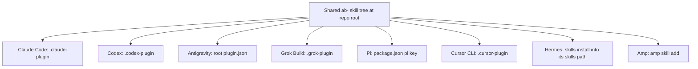
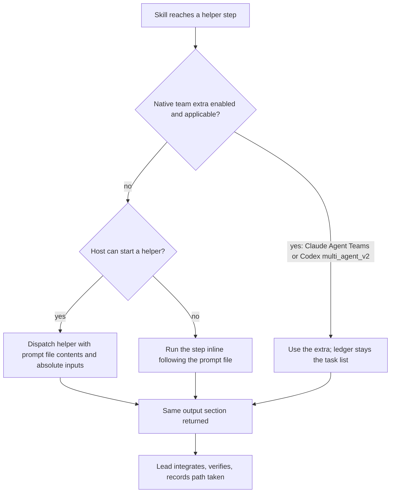
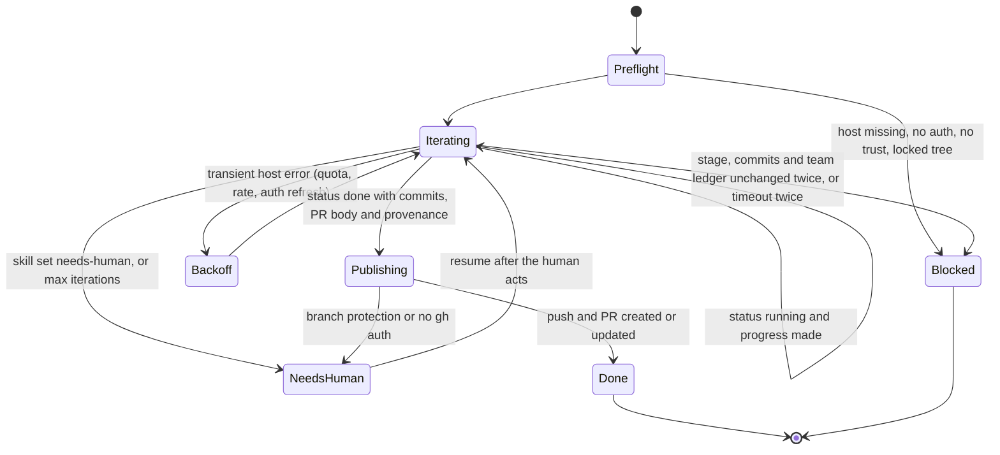
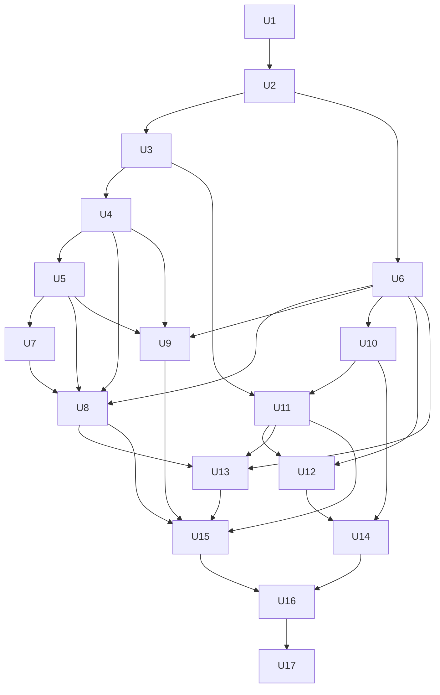

# Agent Blueprint v4.0 Tool-Agnostic Rebuild - Plan

**Target repo:** `project-template/project-template` (GitHub `Ninety2UA/claude-code-blueprint`, renamed `agent-blueprint` at release). All file paths below are relative to that repo unless they start with `.claude/`, which means the `claude-eng` workspace that holds this plan and its research.

## Goal Capsule

- **Objective:** A developer on any of eight coding tools (Claude Code, Codex CLI, Antigravity, Grok Build, Pi, Cursor CLI, Hermes, Amp) installs Agent Blueprint and runs its main pipelines end to end, on the model and effort they chose.
- **Means:** One shared `ab-` skill tree at the repository root, with a committed native manifest per tool (Key Decision "A native manifest per tool", KTD1, KTD10).
- **Product authority:** The maintainer. Decisions marked `session-settled` were made by the maintainer and are not reopened during execution. The R wins on product behavior; a KTD wins on mechanism within its cited R.
- **Open blockers:** PR #15 (v3.8.0, the 2026-09-27 watcher fixes) must merge before U1 starts, because this work rewrites the same skill files.
- **Execution profile:** Deep, 17 units in four phases. U8 and U9 are skill sweeps that split well across parallel helpers by skill batch. The maintainer picks model and effort per phase.
- **Stop conditions:** Stop and ask the maintainer when a settled decision proves infeasible (for example, a tool cannot discover skills by any route), when meeting R6 would require dropping behavior rather than moving it to `references/`, or when a smoke failure is in our code and cannot be fixed inside the owning unit.
- **Tail ownership:** The executor opens one PR per phase against the `release/v4` integration branch and gets CI green; `main` keeps serving v3.8.0 until release. The maintainer merges, runs the local smoke test, renames the GitHub repository, and publishes the release.

---

## Product Contract

**Product Contract preservation:** changed: R28-R30 added (release rule for vendor bugs; team skills as a portable base with native extras) from maintainer decisions made during planning; AE5 narrowed and AE6 added; F3 outcome, Success Criteria, Scope Boundaries and Dependencies updated to match; the AGENTS.md precedence assumption replaced by the verified fact; the deferred Outstanding Questions resolved into the Planning Contract (KTD1-KTD19); the Problem Frame count updated to 21 after v3.8.0.

### Summary

Rebuild claude-code-blueprint as Agent Blueprint v4.0: one set of `ab-`-prefixed skills in agentskills format that installs natively in all eight tools, with agents folded into the skills as prompt files and `AGENTS.md` as the canonical instructions file.
Instructions across the project are rewritten as lean principles, and rules that must always hold move into tests and CI.
The user's own model and effort choice drives every step; skills only mark steps that can safely run lighter.

### Problem Frame

The blueprint works only in Claude Code, and its own docs say so on purpose: the README put multi-harness work "outside the single-harness, zero-dependency scope".
The people who want it now include the maintainer switching between Claude Code and Codex, teams where some members use Cursor or Pi, and public users who find the repo and run other tools.

Several parts block them today.
21 of 55 SKILL.md files exceed Codex's 8,000-byte skill limit.
The 29 agents are Claude Code agent files with a fixed `effort:` tier, which other tools can't load and which caps a user who picks `xhigh` or `max` at `high`.
The autonomous ship loop calls `claude --print` and depends on a Stop hook, which exists only in Claude Code and Codex.
The root `CLAUDE.md` and the template lean on hard rules ("Analysis Paralysis Guard", "Files under 500 lines", "Must ask the user FIRST"), which the Claude 5 and GPT-6 Astra guidance says make newer models stall or follow text too literally.
The project name ties it to one vendor.

### Actors

- A1. Maintainer: owns releases, runs the smoke test, holds accounts for all eight tools.
- A2. Developer: installs and runs Agent Blueprint in any one of the eight tools; may be a solo user switching tools, a team member, or a public user who has never used Claude Code.
- A3. Host tool: the coding CLI that loads skills, may or may not offer subagents, hooks, headless mode, or per-dispatch effort.

### Key Decisions

- **All three goals in one plan: portability, user-chosen model and effort, leaner instructions.** Each skill is rewritten once instead of twice. Governs R5-R17. (session-settled: user-directed — chosen over staging portability first and the instruction audit later, or the audit first: both skill rewrites touch every skill.)
- **All eight tools in v1.** Governs R1, R3, R27. (session-settled: user-directed — chosen over Claude Code plus the proven four (Codex, Antigravity, Grok Build, Pi): the maintainer wants full reach in the first release and accepts the research cost for Cursor CLI, Hermes and Amp.)
- **"Supported" means the main pipelines run end to end.** Extras a tool lacks, such as hooks, may be missing if the docs say so. Governs R3, R4. (session-settled: user-approved — chosen over "installs and skills load" and "same as Claude Code": pipelines are the product, and full parity would exclude tools without hooks.)
- **Agents become prompt files inside the skills that use them.** One copy works everywhere and effort follows the user. Governs R11. (session-settled: user-approved — chosen over keeping Claude Code agents plus generated Codex copies, and over prompt files plus optional installed agents: fewer formats to maintain; the loss of `/agents` listing and per-agent tool limits is accepted.)
- **agentskills standard plus a short allowlist of extra keys.** Governs R5. (session-settled: user-approved — chosen over strict `skills-ref validate` and over moving Claude-only hints to side files: keeps `argument-hint` for Claude Code users while other tools ignore it.)
- **Principles with reasons, and tests for the must-haves.** Governs R15-R17. (session-settled: user-approved — chosen over a light trim and over a facts-only minimal file.)
- **Clean break, released as v4.0.** Skills and the project may be renamed and restructured freely; an upgrade guide explains it. Governs R9, R24, R25. (session-settled: user-directed — chosen over keeping skill names stable and over "no visible change": the maintainer prefers the best cross-tool design.)
- **One ship runner for any tool; hooks are optional.** Governs R18-R20. (session-settled: user-approved — chosen over looping inside one session and over autonomous mode only in hook-capable tools.)
- **New name: Agent Blueprint.** Governs R24. (session-settled: user-directed — chosen over a new name (Shipwright, Plumbline, Keel, Groundwork were offered) and over plain "Blueprint".)
- **`ab-` prefix on every skill.** Shared skill folders in most tools would otherwise collide with other packs using names like `brainstorming`. Governs R9. (session-settled: user-directed — chosen over `bp-` (the recommendation), `bp-` with one short exception, and plain names.)
- **The user chooses model and effort; the blueprint never prescribes one.** Governs R12, R13. (session-settled: user-directed — the maintainer rejected recommending a fixed level such as `/effort high` and rejected fixed agent effort tiers.)
- **A native manifest per tool, no converter.** Tools without a plugin system get an installer that copies the shared skills into their skills location. Governs R1, R2. (session-settled: user-approved — chosen over a build step that generates per-tool copies, because a converter breaks every time a host changes its format.)
- **Proof by a local scripted smoke test.** Governs R21. (session-settled: user-approved — chosen over a manual checklist and over running the tools in CI on every PR: most tools need paid accounts and secrets.)
- **The docs record the reversal of the single-harness decision.** Governs R26. (session-settled: user-directed.)
- **A tool broken by its vendor's bug is marked degraded, not release-blocking.** Governs R28. (session-settled: user-approved — chosen over always blocking the release and over blocking only v4.0: one vendor's bug should never hold back the other seven.)
- **Team skills become a portable base merged into the existing parallel-work skill.** Governs R29. (session-settled: user-directed — chosen over keeping `agent-teams` and `team-execution` as Claude-only extras and over removing them.)
- **Native team extras for Claude Agent Teams and Codex `multi_agent_v2` in v4.0; Hermes Kanban later.** Governs R30. (session-settled: user-directed — chosen over all three extras now, over Claude only, and over adding a multi-session runner.)

### Requirements

**Reach and install**

- R1. Agent Blueprint installs in each of the eight tools through that tool's own install mechanism; where a tool has no plugin system, a documented installer places the skills where the tool discovers them.
- R2. One shared skill tree is the only source of skill content; per-tool manifests point at it and are committed, never generated.
- R3. In each of the eight tools, every skill is discoverable and the main pipelines (at least build, ship, review and debug) complete end to end.
- R4. Each tool has a support note stating what is missing or different there, such as absent hooks or no subagents.



**Skill format**

- R5. Every skill conforms to the agentskills specification, uses its optional directories (`scripts/`, `references/`, `assets/`) where they fit, and carries no frontmatter keys beyond the spec and a short named allowlist.
- R6. Every SKILL.md stays within 8,000 bytes, and every description within 1,024 characters.
- R7. Skill prose is tool-neutral: it names the capability first, gives tool names only as examples, and states a fallback when a tool lacks the capability.
- R8. Skill bodies contain no `$ARGUMENTS`, platform variables such as `${CLAUDE_PLUGIN_ROOT}`, cross-skill relative paths, or load-time pre-resolution; bundled scripts are located from the skill's own directory and run through their interpreter.
- R9. Every skill name carries the `ab-` prefix.
- R10. A skill meant to run only when the user invokes it stays manual-only in every tool that can control implicit invocation.

**Agents and model choice**

- R11. The 29 agents become prompt files inside the skills that dispatch them; in a tool without subagents, the skill runs that step itself.
- R12. No skill, prompt file or instructions file prescribes a model or effort level; demanding steps follow the user's session choice, and a step may be marked as safe to run at lower effort where the host supports per-dispatch effort.
- R13. The docs show how to choose the model and effort in each of the eight tools.

**Project instructions**

- R14. `AGENTS.md` is the canonical project instructions file, both for this repo and in the scaffold the template gives new projects, and every one of the eight tools loads it.
- R15. The root instructions and the template instructions state principles with their reasons, drop generic advice current models already follow, and stay under about 200 lines.
- R16. Rules that must always hold (for example, never commit secrets) are enforced by a test, CI check, hook where available, or permission, not only by prose.
- R17. Skill prose follows the same standard: no "think carefully" lines, no ask-first wording that would stall a literal-minded model, and examples trimmed to what the skill needs.

**Autonomous loop and hooks**

- R18. The ship runner drives the autonomous loop through the headless mode of whichever tool the user runs and needs no hooks.
- R19. Hooks (the prompt-injection guard, the context monitor, the session-start summary) remain optional enhancements where a tool supports them; no pipeline depends on them.
- R20. The runner completes its loop in tools that deny destructive commands in headless mode.

**Team work**

- R29. Parallel team work (the former `agent-teams` and `team-execution` skills and ship's `--swarm` option) runs in all eight tools through the portable parallel-work skill, using helpers where the tool has them and running tasks one after another where it does not.
- R30. Where the user has switched on Claude Code Agent Teams or Codex `multi_agent_v2`, team work uses that native feature as an optional extra, and the base keeps a slot so further tools' extras can be added without a rewrite.

**Verification and gates**

- R21. A local smoke-test script runs a sample project through the main pipelines in each installed tool's headless mode and writes a pass/fail table per tool and pipeline; the maintainer runs it before every release.
- R22. CI enforces, for every change: the agentskills format and allowlist, the size caps (R6), the banned tokens (R8), the `ab-` prefix, the manual-only pairing (R10), version equality across every manifest, and `claude plugin validate --strict`.
- R23. A before-and-after evaluation shows that the leaner instructions and skills do not make pipeline outcomes worse.
- R28. When a tool fails the smoke test only because of a bug on the vendor's side, the release still ships, and that tool's support note marks it degraded with what is broken and a link to the upstream issue until it passes again.

**Identity, migration and docs**

- R24. The project is renamed Agent Blueprint and the repository `agent-blueprint`, and every surface that names it (manifests, README, website, installer, CI, docs; about 22 files today) is updated.
- R25. The release is v4.0.0 and ships an upgrade guide that maps every old skill name to its new name and explains what moved (agents into skills, `CLAUDE.md` to `AGENTS.md`).
- R26. The README and a decision record state that the single-harness scope decision is reversed, and why.
- R27. Research into how Cursor CLI, Hermes and Amp discover, install and invoke skills is part of this work, not a follow-up.

### Key Flows

- F1. First run in a non-Claude tool
  - **Trigger:** A2 installs Agent Blueprint in, say, Pi.
  - **Actors:** A2, A3
  - **Steps:** A2 follows the Pi install note, including its trust step; Pi lists the `ab-` skills; A2 invokes a pipeline skill the way Pi invokes skills; helper steps run as subagents if Pi has them, otherwise inline.
  - **Outcome:** The pipeline completes on A2's model and effort.
  - **Covered by:** R1, R3, R9, R11, R12
- F2. Autonomous ship run
  - **Trigger:** A2 starts the ship runner in a project.
  - **Actors:** A2, A3
  - **Steps:** The runner calls the chosen tool's headless mode repeatedly until the ship goal is met or a stop condition fires; hooks add guards only where the tool has them.
  - **Outcome:** The work ships without A2 driving each step.
  - **Covered by:** R18, R19, R20
- F3. Release verification
  - **Trigger:** A1 prepares a release.
  - **Actors:** A1
  - **Steps:** CI gates pass; A1 runs the smoke test locally across all eight tools; A1 reads the pass/fail table.
  - **Outcome:** The release claims full support for tools whose pipelines pass, marks tools broken by vendor bugs as degraded, and blocks on failures in our own code.
  - **Covered by:** R21, R22, R28
- F4. Existing Claude Code user upgrades
  - **Trigger:** A v3.x user moves to v4.0.
  - **Actors:** A2
  - **Steps:** A2 reads the upgrade guide, removes v3, installs Agent Blueprint under its new name, and uses the new `ab-` skill names.
  - **Outcome:** A2 runs the same pipelines under the new names.
  - **Covered by:** R24, R25

### Acceptance Examples

- AE1. **Covers R3, R4, R19.** Given a Codex user who has not trusted hooks, when they run the review pipeline, then it completes, and the Codex support note says the injection guard is inactive without hooks.
- AE2. **Covers R12.** Given a Claude Code user on `xhigh`, when a pipeline dispatches a review step, then the step runs at `xhigh`; a step marked safe for lower effort may run lower only where the host supports per-dispatch effort.
- AE3. **Covers R11.** Given a tool with no subagent support, when a skill reaches a step that used to dispatch an agent, then the skill performs that step itself and the pipeline still completes.
- AE4. **Covers R10.** Given a manual-only skill installed in Codex, when the user describes a matching task without naming the skill, then Codex does not invoke it on its own.
- AE5. **Covers R21, F3.** Given one tool whose ship pipeline fails in the smoke test because of our code, when A1 reviews the table, then the release does not ship until it passes.
- AE6. **Covers R28, F3.** Given one tool whose ship pipeline fails because of a confirmed vendor bug, when A1 reviews the table, then the release ships and that tool's support note marks it degraded with a link to the upstream issue.
- AE7. **Covers R29.** Given Pi without a subagent add-on, when the user runs parallel team work on a three-task plan, then the tasks run one after another through the same task ledger and the result matches a helper-based run in shape.

### Success Criteria

- The smoke-test table shows every main pipeline passing in all eight tools for v4.0.0, or marked degraded under R28.
- All CI gates in R22 pass on the release commit.
- The root `AGENTS.md` and the template instructions both meet the R15 length target.
- The R23 evaluation shows no pipeline outcome worse than v3.8.0.

### Scope Boundaries

**Deferred for later**

- Running the eight tools inside CI; CI covers format, size and naming only (R22).
- Tools beyond the eight, such as OpenCode, Gemini CLI, Kiro or Windsurf.
- New pipelines or skills; this release ports and rewrites what exists.
- A Hermes Kanban team extra, and a runner that drives several headless sessions in parallel worktrees.

**Outside this product's identity**

- A converter or build step that generates per-tool skill copies.
- Model-specific tuning of skill text for any one model or vendor.

### Dependencies / Assumptions

- PR #15 (v3.8.0) merges and is released before implementation begins.
- A1 has all eight tools installed and signed in, including any paid plans, for the smoke test. On 2026-09-28 the maintainer's machine had Claude Code, Codex, Antigravity, Grok Build and Cursor CLI; Pi, Hermes and Amp still need installing.
- Verified: Claude Code reads `AGENTS.md` only when no `CLAUDE.md` exists; a `CLAUDE.md` that is a symlink to `AGENTS.md`, or that contains `@AGENTS.md`, loads it once; a regular-file `CLAUDE.md` at a plugin root fails `claude plugin validate --strict`.
- Codex truncates a SKILL.md at 8,000 bytes (`MAX_SKILL_PROMPT_BYTES`) when a root `plugin.json` declares the Agent Plugins `$schema`; its combined `AGENTS.md` budget is 32 KiB; its plugins cannot bundle agents.
- Since Claude Code 2.1.281, a dangerous `rm` is denied in headless mode even with permission checks skipped (cli-watch D14); R20 accounts for it.
- Verified on 2026-09-28: Antigravity 1.2.12 headless mode completes file writes, shell commands and project skills and exits cleanly; older hang reports (#508, #841, #947, #548) predate fixes in its changelog. A headless run without `--dangerously-skip-permissions` may still wait for approval.

### Sources / Research

- `.claude/handoff-2026-09-27-portability/HANDOFF.md`: goals, recommended architecture, and consequences for the blueprint.
- `.claude/handoff-2026-09-27-portability/research/`: per-host manifests, portability rules, size caps and gates.
- `.claude/handoff-2026-09-27-portability/research/codex-report.md` and `research/codex-docs/`: Codex skills, agents, hooks, `AGENTS.md` limits, and the GPT-6 Astra guidance (`codex-docs/blog_rethinking.md`).
- `.claude/handoff-2026-09-27-portability/research/articles/`: Claude context-engineering, an agent-file audit, effort spending, Opus 5.5 guidance.
- `.claude/handoff-2026-09-27-portability/research/planning-2026-09-28/`: planning research. `repo-research.md` (dispatch map, rename hotspots, drift-gate locations), `docs-cc-codex-spec.md` (Claude Code, Codex and agentskills facts, tested), `web-agy-grok-pi-ce.md` and `web-cursor-hermes-amp.md` (per-tool install, headless, hooks), `web-team-features.md` (team features per tool), `agent-native.md` and `spec-flow.md` (dispatch contract, runner states, edge cases), `learnings.md` (past decisions and gotchas), `agy-headless-check.md` (local test).
- `.claude/repo-watch/reports/2026-09-27-repo-report.md` §4 and `.claude/cli-watch/reports/2026-09-27-cli-report.md`: portability findings routed here; Opus 5.5 effort default; headless `rm` denial.
- agentskills specification: <https://github.com/agentskills/agentskills>

---

## Planning Contract

### Key Technical Decisions

- KTD1. **Flatten the plugin into the repository root.** `skills/`, `hooks/` and the plugin manifests move from `plugins/claude-code-blueprint/` to the root, and `plugins/` goes away. Antigravity, Grok Build, Pi and Cursor install straight from a git URL and expect manifests and `skills/` at the source root; pointing each manifest into a subdirectory would need per-tool path keys or symlinks, and symlinks break on Windows checkouts. Cost: the Claude Code plugin cache now carries about 7.5 MB of website, docs and ebook (`node_modules/` is untracked). Because the whole repository becomes installable, no `SKILL.md` may exist outside `skills/`: test fixtures use a different file name and are copied into a temporary directory at test time, so recursive installers (`hermes skills install`, `amp skill add`, `npx skills add`) never pick them up.
- KTD2. **Prompt files live in `references/agents/` of the skill that dispatches them; shared ones are copied.** The 17 agents used by one skill move into it. The other 12 are used by two to ten skills (`code-reviewer` in 10; `findings-synthesizer` and `learnings-researcher` in 7); each gets one owner skill and byte-identical copies in the others, recorded in `scripts/prompt-owners.json` and checked by the gate (KTD5). Each prompt file opens with a short role header: what it may change (read-only or writes), whether it is safe at lower effort, and that it never starts further helpers. It ends with a fixed output section so a dispatched run and an inline run return the same shape. The `team-lead` design becomes "the main session coordinates" because many hosts forbid nested dispatch. No owner may be a skill that U7 removes. (session-settled: user-approved — chosen over one shared prompt folder referenced across skills: cross-skill paths break copy-installed skills and R8.) Conflict call-out on the Key Decision on agents: whether Claude Code's general-purpose helper inherits the session effort is unverified, and its dispatch takes no effort parameter; if it does not inherit, AE2 cannot hold on Claude Code. U5 probes this first, and a failed probe is a stop condition.
- KTD3. **Five canonical wordings, copied byte-identically.** Each copy is one fixed paragraph matched exactly by the gate, followed where needed by a separate line naming the site-specific prompt file and inputs. `scripts/sync-shared.py` rewrites every copy from the owner and has a check mode the gate calls, so nobody hand-edits the roughly 60 copies. Owner file `skills/ab-writing-skills/references/capability-snippets.md` holds: dispatch-or-inline (imperative; passes the prompt file's absolute path where the helper shares the filesystem, and its contents otherwise; same output shape), ask-the-user (the host's blocking question tool if it is in the tool list, at most three options, numbered-list fallback, and in headless runs take the documented default and log it), task tracking (the plan file's checkboxes are durable; a host tracker is an optional mirror), the lower-effort hint (lower the dispatch effort only where the host accepts it and the user has not asked otherwise), and the skill-directory anchor plus interpreter probe for bundled scripts. The gate fails when a copy differs from the owner.
- KTD4. **Skills name other skills in prose.** Bodies say "use the `ab-writing-plans` skill", never `/ab-writing-plans`, because invocation differs by host (`/name`, `$name`, `/skill:name`, prose-only on Amp, namespaced on Hermes plugins). User-facing text renders `/ab-name` only where output is shown to the user, with the per-host forms in the support notes.
- KTD5. **New gates are stdlib Python with shrink-only allowlists.** `scripts/check-portability.py` owns skill-level rules; `scripts/check-manifests.py` owns manifest rules. Both land early (U3) with an allowlist of today's violations in `scripts/portability-allowlist.json`; an allowlisted item that no longer violates fails the gate, so the list can only shrink, and it must be empty at release. The file has two sections. `skills` holds skill-level violations and must be empty when Phase 2 ends; `manifests` holds the missing host manifests and the existing `hooks/hooks.json`, drained by U11 and U12, and must be empty at release. Only U3 seeds entries: a later unit that pushes a skill over a rule fixes it in the same unit rather than adding an entry. PyYAML stays optional locally and required in CI, as `check-skill-collisions.py` does today. The hard 8,000-byte cap on the whole SKILL.md (frontmatter plus body, line endings normalized) replaces the warn-only body-size report, because R6 and Codex's limit apply to the whole file.
- KTD6. **The autonomous run is driven by a state file, not stdout.** `.agent-blueprint/run/state.json` holds status (`running`, `done`, `blocked`, `needs-human`), stage, iteration, host, driver (`runner` or `interactive`), session id, a decisions log, and a provenance marker naming the skill and version that wrote it. The PR body always lives at `.agent-blueprint/run/pr-body.md`; the runner never publishes a path read from state, rejects the file when it or any directory on its path is a symlink or when it is not a regular file, and publishes the bytes it read once through that checked file. The runner records the base SHA, branch, remote URL, `.git/config` hash and iteration count itself at first preflight, in a runner-owned file outside the working tree (under the user's state directory, keyed by repository), reuses them on `--resume`, and ignores any SHA or count in state. The done check and the secret-scan range are always recorded-base..HEAD. The skill writes the file; only the runner deletes run files. "Done" requires status `done`, new commits since the recorded base, the PR body file, and a matching provenance marker. Every pipeline skill also writes a per-invocation record, `.agent-blueprint/run/provenance/<skill>.json`, with the skill, its version from its own frontmatter `metadata.version` (which `check-manifests.py` holds equal to the release version), and the path taken at each helper step, written by the KTD3 dispatch snippet. This retires the `<promise>DONE</promise>` grep, which echoed skill text could trigger. The provenance marker guards against echoed text; it is not a security control. The runner treats every field as untrusted input: `status` and `driver` must match their enums, the session id must match a strict character pattern and is passed as a quoted argument, never spliced into a command string, and on `--resume` the host and any opt-in come from the command line, with the KTD15 checks re-run.
- KTD7. **In autonomous runs the runner pushes and opens or updates the PR.** The skill commits and writes the PR body, then sets status `done`. Host sandboxes may block network or `.git` writes, and one host-independent publish step is easier to trust. Where the host's posture cannot write `.git` (Codex `workspace-write` protects it as read-only), the skill leaves its changes in the working tree with the intended message in `.agent-blueprint/run/commit-msg.md`, and the runner commits after each iteration; the done check and the stall detector count those commits. The stall detector also counts completed team-ledger tasks and changed task files (excluding run state and logs) as progress, so a run is stalled only when the stage, the commit history and the ledger are all unchanged for two iterations. The runner exports whether `.git` is writable next to its marker variable; when it is not, skills run in no-commit mode, and review steps diff the working tree plus untracked files against the merge base instead of a commit range. Before any push the runner:
  - scans the outgoing range and the PR body with a stdlib secret-pattern scan and stops as `needs-human` on a hit, without printing the match;
  - pushes only to the remote URL and branch it recorded at preflight, with git hooks disabled;
  - stops as `needs-human` if `.git/config` changed during the run, or if the range touches CI configuration (`.github/workflows/`, `.github/actions/`), unless the user passed an explicit allow flag.

  Interactive runs keep publishing from the skill, which runs the same secret scan first. (session-settled: user-approved — chosen over the agent publishing from inside each host's sandbox.)
- KTD8. **Working state leaves the instructions file and `.claude/`.** Session continuity notes go to `docs/context/STATUS.md`; skills write the project instructions file only in the explicit learnings step, resolving it as `AGENTS.md`, then `CLAUDE.md`. Blueprint-owned working folders (plans in progress, review runs, debug notes, run state) move from `.claude/` to `.agent-blueprint/`, which carries its own `.gitignore` so the user's root `.gitignore` stays untouched: `run/` and `team/` are ignored, and plans and notes are tracked. The runner's preflight and every skill that first creates `.agent-blueprint/` write that `.gitignore` when it is missing, so unscaffolded repositories get it too, and the runner's clean-tree check never trips on its own state. Session-wrap never emits HTML comments, because Hermes refuses a context file containing them. (session-settled: user-approved — chosen over keeping state in the instructions file and folders under `.claude/`: notes written to `AGENTS.md` never load in repos that still have a `CLAUDE.md`, and `.claude/` looks foreign or protected in other tools.)
- KTD9. **Instruction files.** The repo root gets `AGENTS.md` with `CLAUDE.md` as a symlink to it, because a regular `CLAUDE.md` at a plugin root fails `validate --strict`. The scaffold ships `AGENTS.md` plus a one-line `CLAUDE.md` containing `@AGENTS.md`: Claude Code expands it, and Cursor, which loads both files, and possibly Grok (unverified, see Deferred to Implementation) pay one extra line instead of a duplicate file. `ab-project-start` merges into an existing `AGENTS.md` or `CLAUDE.md` and never overwrites either. Because the whole repository installs as the plugin, U11 checks whether Antigravity applies this repository's maintainer `AGENTS.md` to user sessions; if it does, a short root `GEMINI.md` tells it not to.
- KTD10. **One committed manifest per tool, no Agent Plugins `$schema` at the root.**

  | Tool | Manifest or route | Key points |
  |---|---|---|
  | Claude Code | `.claude-plugin/plugin.json`, `.claude-plugin/marketplace.json` (source `./`) | Hooks declared here |
  | Codex | `.codex-plugin/plugin.json` with `skills: ./skills/`; `.agents/plugins/marketplace.json` | `agents/openai.yaml` per manual-only skill; hooks declared here |
  | Antigravity | root `plugin.json` (name, version; no `$schema`, no `skills` key) | `agy plugin install <git-url>`; `agy plugin validate` |
  | Grok Build | `.grok-plugin/plugin.json` with `skills: ./skills/`; `.grok-plugin/marketplace.json` with a git-URL source | Grok reads this before `.claude-plugin/` |
  | Pi | root `package.json` with `"pi": {"skills": ["./skills"]}`, `private: true` | `pi install git:...`; recommend `pi-subagents` and `pi-ask-user` |
  | Cursor CLI | `.cursor-plugin/plugin.json` | `cursor-agent plugin marketplace add <git-url>`, or copy into `~/.agents/skills` |
  | Hermes | no manifest; `hermes skills install` or `skills.external_dirs` | Keeps bare `ab-` names; the native plugin route hides skills from the index |
  | Amp | no manifest; `amp skill add <git-url>` | Also auto-loads the Claude Code plugin cache, so the support note warns against double install |

  `check-manifests.py` enforces equal versions across every versioned manifest and `package.json`, the `skills` key where Codex and Grok need it, no root `$schema`, and the name `agent-blueprint`.
- KTD11. **One hook file per host, for Claude Code and Codex only, under non-conventional names.** `hooks/claude-code.json` and `hooks/codex.json` are each declared by path in their own manifest, and no `hooks/hooks.json` exists, because Grok loads that conventional path from any plugin and would run handlers with the wrong root variable. The Codex file follows Codex's own shape (a single command string, no `args`), keeps only events and matchers Codex has (no `Read` or `WebFetch` matchers, no `TaskCompleted` or `TeammateIdle`), and tolerates concurrent runs of the same event. The session-start hook stops injecting a hardcoded skill list, points at `STATUS.md`, and warns when the v3 plugin is still enabled. The Stop hook reads `state.json` and stands down when the run's driver is the runner (the runner also exports a marker variable), because headless `claude -p` and `codex exec` run Stop hooks and would otherwise stall every iteration. The Agent Teams hooks stay in the Claude Code file as part of the Claude extra (KTD14). The Codex file carries session-start, context monitor, prompt guard, commit validation and the Stop hook; the read-injection scanner and the fetch cache have no Codex event and are absent there, which the Codex support note states. Every handler exits without acting unless it detects the host it was written for, because Cursor imports Claude Code plugins and runs their hooks. If U12 finds that Codex honors only a conventional hook path, the Grok manifest declares empty hooks instead.
- KTD12. **Manual-only set: `ab-plugin-update` and `ab-migrate`.** Marking a skill manual-only also hides it from sibling skills on Claude Code, Codex and Grok, so no pipeline may call a manual-only skill; the gate fails if the manual-only set meets the set of skills referenced from other skills. Each manual-only skill carries `agents/openai.yaml` with `allow_implicit_invocation: false`. Amp and Hermes cannot enforce manual-only, so their support notes say so and the two descriptions avoid broad trigger words such as "update".
- KTD13. **Descriptions lead with what the skill does, then "Use when".** This replaces the v3 rule in `writing-skills` that descriptions state only when to use a skill; tools such as Amp and Codex choose skills from a short catalog and need the mechanism named first.
- KTD14. **Team base: a file ledger plus dependency waves inside `ab-orchestrate`.** The lead session keeps a task ledger under `.agent-blueprint/team/<run>/` and is its only status writer. It dispatches each unblocked wave (3 to 4 helpers by default, configurable) with a full task packet, isolates helpers in host worktrees where offered and by disjoint file ownership otherwise, and alone integrates, commits and runs the authoritative tests. On hosts whose posture cannot write `.git`, helpers use disjoint file ownership instead of worktrees, and the runner makes the commits (KTD7). Helpers return notes in their fixed output section, and the lead appends them to the ledger, so the lead stays the only writer even when helpers run in separate worktrees or sandboxes. Wave size never exceeds the host's helper limit (Hermes one-shot allows 2), read from `skills/ab-orchestrate/references/host-limits.tsv`; that file is the owner, and `sync-shared.py` copies it into the runner's scripts for the adapter table, so no skill reads another skill's files. Explicit verify and review steps replace the Agent Teams hooks. `references/native-extras.md` holds one section per host extra: Claude Code Agent Teams (only when its environment flag is on and the session is interactive) and Codex `multi_agent_v2` (only when its messaging tools are present), each detected from the tools actually available. (session-settled: user-directed — instantiates the team decisions that govern R29 and R30.)
- KTD15. **One host adapter table serves the runner and the smoke test.** `skills/ab-ship-pipeline/scripts/hosts.sh` records, per host: the headless command, the approval posture, how to read the final message, the trust and auth preflight (including Antigravity's `allowNonWorkspaceAccess`, without which reading the plugin's prompt files stalls), the maximum helpers per wave, and the per-iteration timeout. The posture is the least-privileged mode that still completes a run, for example Codex `workspace-write` with its network option on (publishing and, where needed, committing happen outside the sandbox, KTD7), Claude Code `auto`, Cursor `--force` with `--sandbox enabled`, and Grok `--always-approve` with `--sandbox workspace`; the Cursor and Grok sandboxed defaults hold once the U15 ship cell completes under them, and fall back to the opt-in route otherwise. The table also records whether the posture can write `.git`, set by a preflight probe. Hosts that can only run unattended with no guard (Pi; Amp; Antigravity with skip-permissions; any host whose sandboxed run fails) require an explicit opt-in flag on the runner, not just a printed warning. Cursor is always called as `cursor-agent`, because Grok Build installs a conflicting `agent` binary. The smoke test reads the same table so the two never disagree.
- KTD16. **`install.sh` becomes a thin multi-host helper.** It detects installed tools and runs each tool's native install command, or copies `skills/` into the tool's documented skills folder for Hermes and a plain copy install. It stops writing Claude Code's registry files by hand. Copy installs write an install record listing the directories they created, so a re-run removes skills that were renamed or deleted; `ab-plugin-update` points copy-install users at the re-run. `--scaffold` copies from `skills/ab-project-start/assets/`. `--legacy` (flat copies into a project's `.claude/`) is retired in v4.0 under the clean break, and `ab-migrate` cleans up old legacy copies.
- KTD17. **Skill inventory.** `agent-teams` and `team-execution` merge into `ab-orchestrate` (R29), so v4.0 ships 53 skills; `migrate-to-plugin` becomes `ab-migrate`. The old-to-new name map is owned by `docs/upgrade/v4-skill-names.tsv`, with byte-identical copies at `skills/ab-executing-plans/references/v4-skill-names.tsv` and `skills/ab-migrate/references/v4-skill-names.tsv`, registered in `scripts/prompt-owners.json` and kept in sync by `sync-shared.py`, because copy installs carry only `skills/` and R8 bans paths outside a skill. The skills read their own copy; the gates' old-name and removed-name checks exempt these registered copies.
- KTD18. **One canonical install route per host, and no double catalogs.** Several routes overlap: `~/.agents/skills` is scanned by Codex, Cursor, Pi, Grok and Amp; `amp skill add` writes a project `.agents/skills` that others read; Amp also loads the Claude Code plugin cache, and Cursor shows imported Claude plugins. Each support note names the single route for its host and lists which other hosts' installs already cover it. `install.sh` detects those overlaps and skips the redundant install. The smoke test checks, per host, that the catalog contains each `ab-` name exactly once.
- KTD19. **Pre-release installs use local paths; URL installs are checked after the rename.** Marketplace entries and docs name the final `agent-blueprint` URL, which exists only once the maintainer renames the repository at release. The smoke test installs from the local checkout, and U17 re-checks git-URL installs on each host after the rename. GitHub's redirect keeps v3 URLs working.

### High-Level Technical Design

**Dispatch at each helper step.** Every step that used to call an agent follows the KTD3 wording; the chosen path is recorded so the smoke test can tell a helper run from an inline run.



**Runner lifecycle.** The runner owns transitions and cleanup; the skill only writes `state.json`.



**Unit dependencies.**



### Output Structure

```text
.
├── AGENTS.md                      # maintainer instructions (CLAUDE.md -> AGENTS.md symlink)
├── plugin.json                    # Antigravity manifest (no $schema)
├── package.json                   # Pi package ("pi" key), private
├── .claude-plugin/{plugin.json,marketplace.json}
├── .codex-plugin/plugin.json
├── .agents/plugins/marketplace.json
├── .cursor-plugin/plugin.json
├── .grok-plugin/{plugin.json,marketplace.json}
├── skills/ab-<name>/{SKILL.md,references/,scripts/,assets/,agents/openai.yaml}
├── hooks/{claude-code.json,codex.json,handlers/}   # no hooks/hooks.json (KTD11)
├── scripts/{check-drift.sh,check-skill-collisions.py,check-portability.py,check-manifests.py,sync-shared.py,portability-allowlist.json,prompt-owners.json,record-promo.js}
├── tests/{gates/,hooks/,runner/,smoke/}   # fixtures never named SKILL.md (KTD1)
└── docs/{hosts/<tool>.md,upgrade/{v4.md,v4-skill-names.tsv},releases/}
```

### Assumptions

- Hermes keeps bare skill names when installed through `hermes skills install` or `skills.external_dirs`; the Agent Plugins route would rename them. U11 confirms this on a local Hermes install before the support note claims it.
- Amp's headless flags for mode and effort (`--mode`, `--effort`) are inferred from its SDK docs and are confirmed in U13. U13 also checks whether a more private thread visibility can be set headlessly; if so, the adapter uses it.
- Codex `exec` with `--sandbox workspace-write` may not allow network or `.git` pushes; KTD7 makes the runner independent of the answer.
- Claude Code's general-purpose helper runs at the session effort; U5's spike verifies this before the sweep, and a failure stops the plan for a maintainer decision (KTD2).

### Implementation Constraints

- History-preserving moves (`git mv`) for every relocation in U1, U2, U5, U10 and U14, so blame survives the flatten and rename.
- Scripted multi-file edits run under zsh on the maintainer's machine: pass file lists as arrays, never unquoted `$VAR`, and read exit codes from `$?` (`project_zsh_shell_gotchas` in the maintainer's memory).
- Size cuts reuse the v3.7.1 mover method: move line ranges to `references/`, assert every original non-blank line survives in SKILL.md or a reference, and check each pointer resolves to a real heading.
- `docs/learnings/` and `docs/plans/` keep the old name; they are historical records.

### Sequencing and Phased Delivery

| Phase | Units | Ships as |
|---|---|---|
| 1. Foundation | U1, U2, U3, U4 | PR 1: flattened, renamed tree with gates in place and allowlists recording current violations |
| 2. Content | U5, U6, U7, U8, U9, U10 | PR 2: agents, state, team work, every skill rewritten, instructions; the allowlist's `skills` section empty |
| 3. Hosts and automation | U11, U12, U13, U14 | PR 3: manifests, installer, hooks, runner, migration; the allowlist's `manifests` section empty |
| 4. Proof and release | U15, U16, U17 | PR 4: smoke table, docs, evaluation, v4.0.0 |

All four PRs target a long-lived `release/v4` branch with the same CI, so `main` keeps serving v3.8.0 to existing installs until U17 merges `release/v4` into `main` before tagging and renaming the repository. U8 and U9 split by skill batch across parallel helpers; each batch removes its skills from the allowlist.

### Alternatives Considered

- **Keep the plugin in `plugins/agent-blueprint/` and point each manifest inward.** Rejected: git-URL installs on Antigravity, Pi and Grok expect the source root to be the plugin, and the workarounds are per-tool path keys or symlinks.
- **One shared prompt folder referenced from many skills.** Rejected in KTD2: copy-installed skills lose the folder, and R8 bans cross-skill paths.
- **A per-tool build step that emits tailored skill copies.** Settled against (Key Decision "A native manifest per tool").
- **Keep reading completion from stdout.** Rejected in KTD6: echoed skill text can fake completion, and hosts differ in what they echo.

### Risks and Mitigations

| Risk | Mitigation |
|---|---|
| Eight tools change their CLIs often | One adapter table (KTD15); the smoke test runs before every release; R28 marks vendor breakage as degraded. `/cli-watch` still watches only Claude Code, so between releases, changes in the other seven tools are caught only by the smoke test |
| Copies of shared prompts drift apart | Byte-identity check against the owner (KTD2, KTD5) |
| The 8,000-byte cap forces behavior out of skills | Mover method with a line-survival assertion; stop condition if behavior would be dropped |
| Hermes silently drops a context file or quarantines a skill | Pattern gate over instruction, skill and prompt files; an `AGENTS.md` canary in the smoke test |
| Per-agent tool limits disappear with agent frontmatter | Role header in each prompt file states read-only or write scope; reviewers stay read-only by instruction; accepted in the Key Decision on agents |
| v3 and v4 installed together (110 skills, duplicate hooks) | `ab-migrate`, a session-start warning, installer detection, and an upgrade smoke scenario |
| The Claude Code plugin id changes and the cache does not sync | U17 verifies that `/plugin install` moves an existing v3 install to the new id |
| Unattended hosts with no destructive-command guard (Pi, Amp, Antigravity under skip-permissions, Grok always-approve, Cursor force) | The runner requires an explicit opt-in flag for them and defaults every other host to its least-privileged working posture (KTD15); support notes give the containment option |
| The Stop hook stalls headless runner iterations | The hook stands down under the runner (KTD11); U12 and U13 test it |
| Grok runs Claude-format hooks from a conventional `hooks/hooks.json` | Per-host hook files under non-conventional names and a gate against `hooks/hooks.json` (KTD11); a smoke cell checks no hook fires in Grok, Cursor or Antigravity |
| The same skills appear twice in one tool's catalog | One canonical route per host, overlap detection in `install.sh`, and an exactly-once discovery cell (KTD18) |
| Test fixtures ship as installable skills | Fixtures never named `SKILL.md`; gate on `SKILL.md` outside `skills/` (KTD1) |
| A model-written path leaks a file into a public PR | Fixed PR body path; runner records base and branch itself (KTD6) |
| An unattended agent commits a secret, a CI workflow, or git config that runs on push | Pre-push secret scan, recorded remote with hooks disabled, and `needs-human` on config or CI-path changes (KTD7) |
| Codex's sandbox blocks commits and network | Runner commits where `.git` is read-only; Codex network option on (KTD7, KTD15) |
| Cursor runs imported Claude Code plugin hooks | Each handler exits unless it detects its own host (KTD11) |
| A root `$schema` slips in and Codex truncates skills | `check-manifests.py` fails on it |
| Amp uploads headless threads to the workspace | Stated in the Amp support note and the runner warning |

### System-Wide Impact

- **User repositories:** instruction files change (`AGENTS.md` plus a pointer `CLAUDE.md`), working folders move to `.agent-blueprint/`, and old skill names in existing plans are accepted through the name map.
- **Installed base:** the Claude Code plugin id changes from `claude-code-blueprint` to `agent-blueprint`; v3 must be removed.
- **Public surfaces:** README, website, promo video copy, marketplace listings and the GitHub repository name all change.
- **CI:** new gate jobs and unit tests; `plugin-validate` targets the root.
- **Agent parity:** every capability a skill uses has a stated fallback; the smoke table records which path ran in each tool.

### Deferred to Implementation

- Final wording of the five capability snippets.
- Which sections of each oversized skill move to `references/`.
- Exact headless flags still marked unconfirmed in the research: Hermes `-s` with `-z`, Amp `--mode`/`--effort`, Grok exit codes.
- Whether Grok and Pi load both `AGENTS.md` and a pointer `CLAUDE.md`; the one-line pointer keeps the cost small either way.
- Whether Cursor also accepts the root `plugin.json`; `.cursor-plugin/plugin.json` is the committed route regardless.
- The R23 method: `claude plugin eval` against before-and-after pipeline runs on the smoke fixture.
- For the smoke discovery cell, the non-model source of each host's loaded catalog (a listing command where one exists, otherwise a walk of its documented discovery paths).
- For the smoke hook cell, the trace that shows a hook loaded and stood down, as distinct from never loading (for example an environment-gated log line written before the host check).

### Deferred to Follow-Up Work

- Hermes Kanban as a third native team extra.
- A runner mode that starts several headless sessions in parallel worktrees, possibly across different tools.
- A native Hermes plugin with a bootstrap hook.
- Renaming the ebook PDF, which is a binary file.
- Per-dispatch effort in hosts that add it later.
- Extend `/cli-watch` baselines and change audits to the seven other tools; until then, changes in them between releases are caught only by the pre-release smoke test (R21).

---

## Implementation Units

### Unit Index

| U-ID | Title | Key files | Depends on |
|---|---|---|---|
| U1 | Flatten the plugin and rename the project | `.claude-plugin/`, `skills/`, `hooks/`, `install.sh`, `scripts/check-drift.sh`, `.github/workflows/ci.yml` | — |
| U2 | Rename every skill to `ab-` | `skills/ab-*/`, `docs/upgrade/v4-skill-names.tsv`, `hooks/handlers/session-start.js` | U1 |
| U3 | Portability and manifest gates | `scripts/check-portability.py`, `scripts/check-manifests.py`, `tests/gates/` | U2 |
| U4 | Capability snippets and authoring guide | `skills/ab-writing-skills/` | U3 |
| U5 | Agents become skill-local prompt files | `skills/ab-*/references/agents/`, `scripts/prompt-owners.json` | U4 |
| U6 | Move session state and working folders | skills using `.claude/` or `CLAUDE.md`, `skills/ab-ship-pipeline/references/run-state.md` | U2 |
| U7 | Team work merges into `ab-orchestrate` | `skills/ab-orchestrate/` | U5 |
| U8 | Rewrite batch 1: pipeline skills | 17 pipeline skills | U4, U5, U6, U7 |
| U9 | Rewrite batch 2: remaining skills | 35 remaining skills | U4, U5, U6 |
| U10 | Project instructions and scaffold | `AGENTS.md`, `CLAUDE.md`, `skills/ab-project-start/assets/` | U6 |
| U11 | Host manifests and installer | `.codex-plugin/`, `plugin.json`, `package.json`, `.grok-plugin/`, `.cursor-plugin/`, `install.sh` | U3, U10 |
| U12 | Hooks as optional enhancements | `hooks/` | U6, U11 |
| U13 | Ship runner for any host | `skills/ab-ship-pipeline/scripts/`, `tests/runner/` | U6, U8, U11 |
| U14 | Upgrade path and `ab-migrate` | `skills/ab-migrate/` | U10, U12 |
| U15 | Local smoke test | `tests/smoke/` | U8, U9, U11, U13 |
| U16 | Docs, support notes, website, decision record | `README.md`, `docs/hosts/`, `docs/upgrade/v4.md`, `index.html` | U14, U15 |
| U17 | Evaluation and v4.0.0 release | `docs/releases/`, all manifests | U16 |

### U1. Flatten the plugin and rename the project

**Goal:** The plugin lives at the repository root under the name `agent-blueprint`, and every existing gate passes on the new layout.

**Requirements:** R2, R24; KTD1.

**Dependencies:** PR #15 merged.

**Files:**
- Move: `CLAUDE.md` to `AGENTS.md` (then `CLAUDE.md` becomes a symlink), `plugins/claude-code-blueprint/skills/` to `skills/`, `hooks/` to `hooks/`, `agents/` to `agents/` (removed in U5), `templates/` to `templates/` (moved in U10), `.claude-plugin/plugin.json` to `.claude-plugin/plugin.json`, `scripts/ship.sh` to `scripts/ship.sh` (replaced in U13), `scripts/record-promo.js` to `scripts/record-promo.js`
- Modify: `.claude-plugin/plugin.json` (name, homepage, repository), `scripts/record-promo.js` (repo-root path comment and lookup), `.claude-plugin/marketplace.json`, `install.sh`, `README.md`, `CLAUDE.md`, `index.html`, `docs/images/promo-video.html`, `.github/workflows/ci.yml`, `scripts/check-drift.sh`, `scripts/check-skill-collisions.py`, `hooks/handlers/sdd-cache-pre.sh`, `hooks/handlers/sdd-cache-post.sh`, the four SKILL.md files that name the project (`deep-research`, `plugin-update`, `migrate-to-plugin`, `project-start`)

**Approach:**
1. Move directories with history preserved; the marketplace entry's source becomes `./`.
2. Replace `claude-code-blueprint` with `agent-blueprint` and "Claude Code Blueprint" with "Agent Blueprint" on every live surface; leave `docs/learnings/`, `docs/plans/` and the ebook untouched.
3. Point CI's markdownlint ignore, shellcheck paths and `plugin validate` at the new locations.
4. Rename `CLAUDE.md` to `AGENTS.md` with its content unchanged and make `CLAUDE.md` a symlink to it, because the root is now a plugin root and `validate --strict` rejects a regular `CLAUDE.md` there (U10 rewrites the content later).
5. Keep skill names unchanged here; U2 renames them.

**Execution note:** Mostly packaging. Prove it with the existing gates and a local install, not new unit tests.

**Patterns to follow:** `scripts/check-drift.sh` derives counts from the filesystem; update its paths rather than its logic.

**Test scenarios:**
- The drift gate passes with counts derived from `skills/`, `agents/` and `hooks/hooks.json` at the root.
- `claude plugin validate --strict --json .` passes for the plugin and marketplace at the root, with `CLAUDE.md` a symlink to `AGENTS.md`.
- A local Claude Code install from the checkout lists all 55 skills and 10 hooks.
- A search for `claude-code-blueprint` outside `docs/learnings/`, `docs/plans/` and `ebook/` finds nothing.
- `install.sh --local --legacy --dry-run` still completes in CI on Ubuntu and macOS.

**Verification:** All current CI jobs pass on the flattened tree, and nothing under `plugins/` remains.

### U2. Rename every skill to `ab-`

**Goal:** Every skill directory and `name` carries the `ab-` prefix, and every reference to a skill uses the new name in prose.

**Requirements:** R8, R9; KTD4, KTD17; governed by the Key Decisions on the prefix and the clean break.

**Dependencies:** U1.

**Files:**
- Move: `skills/<name>/` to `skills/ab-<name>/` for all 55 skills
- Create: `docs/upgrade/v4-skill-names.tsv`, `tests/gates/test_skill_names.py`
- Modify: every `SKILL.md` and reference file that names another skill, `agents/*.md`, `hooks/handlers/session-start.js`, `install.sh`, `README.md`, `index.html`, `scripts/check-drift.sh`

**Approach:**
1. Write the name map first; drive the rename from it.
2. Rewrite the 113 `/skill-name` mentions in 24 skill files as prose references ("the `ab-writing-plans` skill"), per KTD4.
3. Update the frontmatter `name` so it matches the directory.
4. Rename user-facing examples in README and the website to `/ab-...` at the output seam only.

**Patterns to follow:** The name map is the single source; `ab-migrate` (U14) and the upgrade guide (U16) read it.

**Test scenarios:**
- Every skill directory starts with `ab-` and matches its frontmatter `name`.
- The name map has one row per v3 skill (55 rows) and every new name exists on disk.
- No skill body contains a slash reference to any old or new skill name.
- A prose reference to a skill that does not exist fails the test.
- The drift gate's skill count is unchanged.

**Verification:** `python3 -m unittest discover -s tests/gates` passes, and the drift gate is green.

### U3. Portability and manifest gates

**Goal:** CI enforces the portability rules, with today's violations recorded in a shrink-only allowlist.

**Requirements:** R5, R6, R8, R9, R10, R22; KTD5, KTD10, KTD12.

**Dependencies:** U2.

**Files:**
- Create: `scripts/check-portability.py`, `scripts/check-manifests.py`, `scripts/portability-allowlist.json`, `tests/gates/test_check_portability.py`, `tests/gates/test_check_manifests.py`, `tests/gates/fixtures/` (fixture skills stored as `SKILL.fixture.md` and copied into a temporary directory by the tests, per KTD1)
- Modify: `.github/workflows/ci.yml`, `scripts/check-skill-collisions.py` (drop its size report; the new gate owns size)

**Approach:** `check-portability.py` checks, per skill and prompt file:
1. Frontmatter keys are the agentskills fields plus `argument-hint` and `disable-model-invocation`; no `effort` or `model`.
2. The name is at most 64 characters, matches the directory and starts with `ab-`; the description is 1 to 1,024 characters.
3. The whole SKILL.md, frontmatter included, is at most 8,000 bytes.
4. No `$ARGUMENTS`, `${CLAUDE_PLUGIN_ROOT}` or other platform variables, no load-time `!` pre-resolution, no path that leaves the skill directory, and no slash skill references.
5. No skill writes to "CLAUDE.md" as a target (KTD8).
6. Snippet copies and prompt-file copies match their owners (KTD3, KTD2).
7. The manual-only set does not meet the set of skills referenced by other skills, and each manual-only skill has `agents/openai.yaml` with implicit invocation off (KTD12).
8. Instruction, skill and prompt files contain none of the Hermes context-scan patterns, including HTML comments.
9. The root and template `AGENTS.md` stay within 200 lines (R15).
10. No `SKILL.md` exists outside `skills/`.

`check-manifests.py` checks the KTD10 table, that no `hooks/hooks.json` exists (KTD11), and that each declared hook file exists. Allowlisted items that no longer violate fail the gate; only this unit seeds the allowlist, split into its `skills` and `manifests` sections (KTD5).

**Execution note:** Test-first. Write a passing fixture and one failing fixture per rule before the rule.

**Patterns to follow:** `scripts/check-skill-collisions.py` (YAML parsing with `REQUIRE_YAML=1` in CI, pointer resolution).

**Test scenarios:**
- A fixture skill that meets every rule passes both gates.
- Each rule has a fixture that fails with a message naming the file and rule: extra frontmatter key, `effort:` key, 8,001-byte SKILL.md, a SKILL.md whose body is under 8,000 bytes but whose whole file is over, 1,025-character description, name without `ab-`, name not matching its directory, `$ARGUMENTS`, `${CLAUDE_PLUGIN_ROOT}`, `!` pre-resolution, `../` path out of the skill, `/ab-x` reference in a body, "write to CLAUDE.md", drifted snippet copy, drifted prompt copy, manual-only skill referenced by another skill, manual-only skill without `openai.yaml`, HTML comment in `AGENTS.md`, "ignore previous instructions" in a prompt file, 201-line `AGENTS.md`.
- A violation listed in the allowlist passes; an allowlist entry that no longer violates fails.
- Manifest fixtures fail on a version mismatch between any two manifests or `package.json`, a missing `skills` key in the Codex or Grok manifest, a `$schema` in the root `plugin.json`, and a name other than `agent-blueprint`.
- Without PyYAML locally the gate warns and still checks everything else; with `REQUIRE_YAML=1` it fails.
- A file named `SKILL.md` under `tests/` fails the gate.
- A `hooks/hooks.json` file fails the manifest gate.

**Verification:** The gates run in CI on every push and pass on the current tree with the allowlist; the unit tests pass.

### U4. Capability snippets and authoring guide

**Goal:** The five canonical wordings exist in one owner file, and the authoring guide teaches the portable rules.

**Requirements:** R7, R8, R12, R17; KTD3, KTD13.

**Dependencies:** U3.

**Files:**
- Create: `skills/ab-writing-skills/references/capability-snippets.md`, `skills/ab-writing-skills/references/portable-authoring.md`
- Create: `scripts/sync-shared.py`, `tests/gates/test_sync_shared.py`
- Modify: `skills/ab-writing-skills/SKILL.md`, `scripts/prompt-owners.json` (records the snippet owner), `tests/gates/fixtures/`

**Approach:**
1. Write the dispatch-or-inline, ask-the-user, task-tracking, lower-effort and skill-directory snippets (KTD3), and the sync tool with its check mode.
2. Rewrite the guide around: outcome first, then the smallest protocol, then judgment; capability, then success contract, then fallback; descriptions that name the mechanism first (KTD13); prose skill references (KTD4); the 8,000-byte budget and when to move content to `references/`.
3. Replace the v3 "descriptions state only when to use" rule.

**Test scenarios:**
- A skill copy that differs from the owner snippet by one byte fails the portability gate.
- The sync tool rewrites a drifted copy to match the owner, leaves the site-specific naming line untouched, and a second run changes nothing.
- An owner entry naming a skill that does not exist fails the gate.
- The authoring guide itself passes every portability rule.
- `ab-writing-skills` leaves the allowlist.

**Verification:** The snippet owner is registered, the gate enforces copies, and the guide's rules match the gate's rules one to one.

### U5. Agents become skill-local prompt files

**Goal:** The 29 agent files are gone; each dispatching skill carries the prompt files it uses, in the shape KTD2 defines.

**Requirements:** R11, R12; KTD2, KTD3; governed by the Key Decision on agents.

**Dependencies:** U4.

**Files:**
- Delete: `agents/`
- Create: `skills/ab-*/references/agents/<name>.md` for each dispatching skill
- Modify: `scripts/prompt-owners.json`, every dispatch site in skill bodies, `scripts/check-drift.sh` (agent count leaves the triple-count claims), and in the same unit every surface that shows an agent count: `.claude-plugin/plugin.json`, `.claude-plugin/marketplace.json`, `index.html` (agent grid, badges, stats), `install.sh`, `README.md` (agents table, tree), `CLAUDE.md`, `docs/images/promo-video.html`; `tests/gates/fixtures/`

**Approach:**
1. Spike first, before moving anything: on each installed host, confirm a skill can read its own `references/` files from the installed location, and confirm whether Claude Code's general-purpose helper runs at the session effort (AE2). A failed effort probe is a stop condition (KTD2).
2. Move the 17 agents used by one skill into that skill.
3. Give each of the 12 agents used by several skills an owner skill (never `agent-teams` or `team-execution`) and copy it with the sync tool.
4. Strip frontmatter; add the role header (write scope, lower-effort safety, no further helpers) and the fixed output section.
5. Replace each dispatch sentence with the KTD3 dispatch snippet.
6. Fold `team-lead` into the coordinating skill so no prompt file dispatches.

**Patterns to follow:** The existing agent bodies supply the content; only the framing changes.

**Test scenarios:**
- No `agents/` directory remains, and no prompt file has frontmatter.
- Every prompt file named at a dispatch site exists in that skill.
- Every copy of a shared prompt matches its owner.
- No prompt file contains wording that tells the reader to start another helper.
- Every prompt file ends with the output section.
- The drift gate passes, and no surface still shows an agent count.
- The spike results (prompt-file reads per host, effort inheritance) are recorded in the unit's PR description.

**Verification:** Gates green; a Claude Code run of the review pipeline dispatches from prompt files with no agent definitions installed.

### U6. Move session state and working folders

**Goal:** Session notes live in the status file, blueprint working folders live under `.agent-blueprint/`, and the run-state contract is defined.

**Requirements:** R14, R18; KTD6, KTD8.

**Dependencies:** U2.

**Files:**
- Create: `skills/ab-ship-pipeline/references/run-state.md`
- Create: `templates/.agent-blueprint/.gitignore` (moves with the scaffold in U10)
- Modify: `skills/ab-context-checkpoint/`, `skills/ab-session-wrap/`, `skills/ab-knowledge-compounding/`, `skills/ab-session-continuity/`, `skills/ab-pause-checkpoint/`, `skills/ab-resume-session/`, every skill that names a `.claude/` working folder (about 60 references), `templates/docs/context/STATUS.md`, `templates/.gitignore`

**Approach:**
1. Replace instruction-file writes with `docs/context/STATUS.md` writes, except the learnings step, which resolves `AGENTS.md` then `CLAUDE.md`.
2. Rename blueprint working folders to `.agent-blueprint/<purpose>/`; leave host-owned paths alone.
3. Define `state.json` fields, the provenance marker, and the rule that only the runner deletes run files.
4. Make session-wrap emit plain text markers instead of HTML comments.

**Test scenarios:**
- No skill body writes to `CLAUDE.md` or `AGENTS.md` outside the learnings step.
- No skill body names a `.claude/` working folder.
- Session-wrap's instructions produce no HTML comment.
- Resume-session reads `STATUS.md` and finds the last checkpoint written by context-checkpoint.
- The run-state reference defines every KTD6 field, the fixed PR body path, and the driver values.
- The `.agent-blueprint/.gitignore` ignores `run/` and `team/` and keeps plans tracked.

**Verification:** Gates green, and the run-state reference covers every KTD6 field (U13 checks its reader against this reference).

### U7. Team work merges into `ab-orchestrate`

**Goal:** Team work runs everywhere through `ab-orchestrate`, with Claude Agent Teams and Codex `multi_agent_v2` as optional extras.

**Requirements:** R29, R30; KTD14.

**Dependencies:** U5.

**Files:**
- Delete: `skills/ab-agent-teams/`, `skills/ab-team-execution/`
- Create: `skills/ab-orchestrate/references/team-ledger.md`, `skills/ab-orchestrate/references/native-extras.md`, `skills/ab-orchestrate/references/host-limits.tsv`
- Modify: `scripts/check-drift.sh` and every surface that shows the skill count (55 to 53: `.claude-plugin/plugin.json`, `.claude-plugin/marketplace.json`, `index.html` skill grid and badges, `install.sh`, `README.md`, `CLAUDE.md`, `docs/images/promo-video.html`), `skills/ab-orchestrate/SKILL.md`, `skills/ab-ship-pipeline/SKILL.md` (`--swarm` routes to `ab-orchestrate`), `skills/ab-swarm-orchestration/SKILL.md`, `skills/ab-subagent-driven-development/SKILL.md`, `skills/ab-dispatching-parallel-agents/SKILL.md`, `docs/upgrade/v4-skill-names.tsv`, `hooks/handlers/task-completed.js`, `hooks/handlers/teammate-idle.js`

**Approach:**
1. Define the ledger, waves, task packet, isolation contract and lead-only commits (KTD14).
2. Write the two extras, each gated on detecting its tools in the session, and a short note on adding more.
3. Point the removed skills' names at `ab-orchestrate` in the name map.
4. Keep the Agent Teams hooks working for the Claude extra.

**Test scenarios:**
- Covers AE7. With helpers disabled, a three-task plan completes one task after another through the ledger, and the ledger matches a helper run in shape.
- Two tasks that claim the same file are placed in different waves.
- A note returned in a helper's output section is appended to the ledger by the lead and reaches the next wave's packet.
- A wave never exceeds the host's helper limit (a limit of 2 splits four ready tasks into two waves).
- The Claude extra section applies only when its environment flag is on and the session is interactive.
- The Codex extra section applies only when its messaging tools are present.
- No skill refers to the removed skill names.

**Verification:** Gates green with 53 skills on every surface; a Claude Code run of the three-task fixture plan completes through the ledger (U15 later repeats it in every host).

### U8. Rewrite batch 1: pipeline skills

**Goal:** The pipeline skills meet every portability and style rule and leave the allowlist.

**Requirements:** R3, R6, R7, R12, R17, R18; KTD3, KTD4, KTD6, KTD13.

**Dependencies:** U4, U5, U6, U7.

**Files:** `skills/ab-build-pipeline/`, `ab-ship-pipeline/`, `ab-brainstorming/`, `ab-writing-plans/`, `ab-executing-plans/`, `ab-review-swarm/`, `ab-requesting-code-review/`, `ab-systematic-debugging/`, `ab-quick-fix/`, `ab-subagent-driven-development/`, `ab-iterative-refinement/`, `ab-autonomous-loop/`, `ab-session-wrap/`, `ab-finishing-a-development-branch/`, `ab-test-driven-development/`, `ab-orchestrate/`, `ab-deep-research/`; `scripts/portability-allowlist.json`

**Approach:** Per skill:
1. Bring the whole file under 8,000 bytes with the mover method; commit `e01d4c2` (PR #14, the v3.7.1 size sweep) is the worked precedent to diff against.
2. Insert the snippets at every host-dependent step.
3. Rewrite rules as principles with reasons; drop "think carefully" lines and stalling ask-first wording.
4. Rewrite the description (KTD13).
5. At every question point, state the headless default.

For `ab-ship-pipeline`: write `state.json` and the provenance marker, never delete run files, and drop the DONE sentinel. For `ab-executing-plans`: accept old skill names in existing plans through its own copy of the name map. Every pipeline skill writes its provenance record at start (KTD6), and review steps support no-commit mode (KTD7).

**Execution note:** Split across parallel helpers by skill; each helper removes only its skills from the allowlist.

**Test scenarios:**
- Each skill in the batch passes every portability rule with no allowlist entry.
- The mover's line-survival check passes for every moved range.
- `ab-ship-pipeline` instructions contain no file deletion and no DONE sentinel, and name every `state.json` field from `run-state.md`.
- A plan file that names `/executing-plans` is handled as `ab-executing-plans`.
- On a fixture whose `.git` is read-only, a build-then-review run leaves changes uncommitted with a commit message, and review reports on the working-tree diff rather than an empty range.
- Each pipeline skill's instructions write its provenance record at start.

**Verification:** No batch-1 skill remains in the allowlist.

### U9. Rewrite batch 2: remaining skills

**Goal:** Every remaining skill meets the rules, and the allowlist is empty.

**Requirements:** R6, R7, R10, R12, R17; KTD3, KTD12, KTD13.

**Dependencies:** U4, U5, U6.

**Files:** `skills/ab-plugin-update/agents/openai.yaml` (create), and the other 35 skills under `skills/ab-*/` (U4 already covers `ab-writing-skills`), including `ab-plugin-update/` (rewritten to point at each host's update command, manual-only), `ab-project-start/` (reads its own `assets/` after U10); `scripts/portability-allowlist.json`

**Approach:** Same per-skill steps as U8, with the same `e01d4c2` precedent. Mark `ab-plugin-update` manual-only with a narrow description, and point copy-install users at re-running the installer (KTD16).

**Execution note:** Split across parallel helpers by skill.

**Test scenarios:**
- Each skill passes every rule with no allowlist entry.
- `ab-plugin-update` is manual-only, has `agents/openai.yaml`, and no other skill references it.
- The allowlist's `skills` section is empty at the end of the unit.

**Verification:** The `skills` section of `scripts/portability-allowlist.json` is empty and the gates pass.

### U10. Project instructions and scaffold

**Goal:** `AGENTS.md` is canonical for this repo and for new projects, written as principles, with must-hold rules enforced elsewhere.

**Requirements:** R14, R15, R16; KTD9.

**Dependencies:** U6.

**Files:**
- Create: `skills/ab-project-start/assets/` (moved from `templates/`), `skills/ab-project-start/assets/AGENTS.md`, `skills/ab-project-start/assets/CLAUDE.md`
- Modify: `AGENTS.md` (rewritten as principles; U1 already made `CLAUDE.md` a symlink to it), `skills/ab-project-start/SKILL.md`, `install.sh` (`--scaffold` source), `scripts/check-drift.sh` (template path)
- Delete: `templates/`

**Approach:**
1. Rewrite the root and template instructions as principles with reasons, under 200 lines each.
2. Sort every ALWAYS/NEVER rule into one of three outcomes and record the ledger in the U16 decision record: enforced by a gate, hook or permission (for example, secrets through the pre-push secret scan in KTD7 and the template `.gitignore`); kept as a principle with its reason; or dropped as default model behavior. Dropped rules include the Analysis Paralysis Guard, "files under 500 lines" and "DRY, YAGNI".
3. Make `ab-project-start` merge into existing instruction files.

**Test scenarios:**
- `validate --strict` still passes after the rewrite.
- The template `CLAUDE.md` contains exactly `@AGENTS.md`.
- Both `AGENTS.md` files are within 200 lines and free of Hermes scan patterns.
- In a project with an existing `CLAUDE.md` that has content, project-start adds the `@AGENTS.md` line and keeps the content.
- In a project with an existing `AGENTS.md`, project-start merges new sections without deleting existing ones.
- In an empty project, project-start writes both files and the docs scaffold.

**Verification:** Gates green; a scaffolded sample project loads `AGENTS.md` in Claude Code, Codex and Antigravity.

### U11. Host manifests and installer

**Goal:** Every tool has its committed install route, all manifests agree on version, and the installer uses native commands.

**Requirements:** R1, R2, R10, R22, R27; KTD10, KTD12, KTD16.

**Dependencies:** U3, U10.

**Files:**
- Create: `.codex-plugin/plugin.json`, `.agents/plugins/marketplace.json`, `plugin.json`, `.grok-plugin/plugin.json`, `.grok-plugin/marketplace.json`, `.cursor-plugin/plugin.json`, `package.json`, `tests/gates/fixtures/manifests/`
- Modify: `.claude-plugin/plugin.json`, `.claude-plugin/marketplace.json`, `install.sh`, `.github/workflows/ci.yml` (manifest gate job; the `install-test` job drops its agent-count assertion and `--legacy` runs, and tests copy installs and `--scaffold` with a 53-skill floor)
- Create if U11's check requires it: `GEMINI.md` (KTD9)

**Approach:**
1. Write each manifest per the KTD10 table.
2. Rewrite `install.sh` to detect tools and run native installs or copy installs (KTD16), with overlap detection (KTD18) and an install record; keep `--dry-run` and `--scaffold`; retire `--legacy`.
3. Confirm on local installs that Hermes keeps bare names, that Cursor, Grok and Antigravity list all skills, and whether Antigravity applies the repo's `AGENTS.md` to user sessions (KTD9).

**Execution note:** Packaging work. Prove it with validators and real installs.

**Test scenarios:**
- `check-manifests.py` passes with all manifests at the same version.
- `claude plugin validate --strict --json .` and `agy plugin validate .` pass.
- `install.sh --dry-run` prints the right command or copy target for each detected tool, and says clearly when a tool is absent.
- `install.sh` never writes Claude Code registry files directly.
- With Codex and Cursor both installed, a copy install into `~/.agents/skills` is done once and the other host is reported as already covered.
- A re-run after a skill is renamed removes the old directory listed in the install record and leaves unrelated user skills alone.
- `install.sh --legacy` exits with a message pointing at `ab-migrate`.
- A copy install into `~/.agents/skills` is discovered by Cursor and Pi.
- Antigravity is installed only through `agy plugin install` and is never reported as covered by the `~/.agents/skills` copy.
- `shellcheck install.sh` passes.

**Verification:** Each installed tool lists 53 `ab-` skills from a fresh install, and the allowlist's `manifests` section holds only the `hooks/hooks.json` entry that U12 removes.

### U12. Hooks as optional enhancements

**Goal:** Hooks help where Claude Code and Codex run them, and nothing depends on them.

**Requirements:** R19; KTD11.

**Dependencies:** U6, U11.

**Files:**
- Move: `hooks/hooks.json` to `hooks/claude-code.json`
- Create: `hooks/codex.json`
- Modify: `hooks/handlers/session-start.js`, `hooks/handlers/ship-loop.sh`, `hooks/handlers/context-monitor.js`, `.claude-plugin/plugin.json` and `.codex-plugin/plugin.json` (hook file paths), `scripts/check-drift.sh` (hook count source)
- Create: `tests/hooks/run-tests.sh`, `tests/hooks/fixtures/`

**Approach:**
1. Remove the hardcoded skill list from session-start and add the v3-enabled warning.
2. Point the Stop hook at `state.json` and make it stand down under the runner (KTD11).
3. Write the Codex hook file in Codex's shape and declare each file by path in its manifest; confirm Codex honors a declared path, and otherwise apply the KTD11 fallback.

**Test scenarios:**
- Session-start output contains no skill list.
- Session-start warns when the v3 plugin is enabled in the user settings fixture and says nothing when it is not.
- The Stop hook blocks exit in an interactive session while `state.json` says `running`, and allows it for `done`, `needs-human`, or a missing file.
- The Stop hook allows exit when the driver is `runner` or the runner's marker variable is set, even while status is `running`.
- A Codex-shaped hook payload produces the same decisions as a Claude Code payload.
- `hooks/claude-code.json` keeps the nested structure; `hooks/codex.json` uses no `args`, no events Codex lacks, and no entry for the read-injection scanner; every handler path resolves.
- A handler run with a Cursor-shaped environment exits without acting.

**Verification:** `bash tests/hooks/run-tests.sh` passes, the allowlist's `manifests` section is empty, and AE1 passes in the smoke test with Codex hooks untrusted.

### U13. Ship runner for any host

**Goal:** One runner drives the autonomous ship loop through any of the eight tools' headless modes.

**Requirements:** R18, R20; KTD6, KTD7, KTD15; governed by the Key Decision on one runner.

**Dependencies:** U6, U8, U11.

**Files:**
- Create: `skills/ab-ship-pipeline/scripts/run.sh`, `skills/ab-ship-pipeline/scripts/hosts.sh`, `skills/ab-ship-pipeline/scripts/scan-secrets.sh`, `tests/runner/run-tests.sh`, `tests/runner/fake-host.sh`
- Delete: `scripts/ship.sh`
- Modify: `skills/ab-ship-pipeline/SKILL.md` (prints the runner command from its own directory), `.github/workflows/ci.yml` (shellcheck paths)

**Approach:**
1. Adapter table (KTD15) for claude, codex, agy, grok, pi, cursor-agent, hermes and amp.
2. Preflight: host present, auth, trust, `gh` auth, clean tree, lock file with PID; record the base SHA, branch, remote URL and a hash of `.git/config`; write `.agent-blueprint/.gitignore` if missing; probe whether the posture can write `.git`; refuse to run on the default branch; require the opt-in flag for unguarded hosts (KTD15); export the runner marker variable (KTD11).
3. Loop: per-iteration outer timeout; read `state.json`; transitions per the lifecycle diagram; transient errors back off without counting; a denied destructive command is logged and the loop continues.
4. Content checks instead of trusting exit code 0.
5. Commit for the skill where the posture cannot write `.git` (KTD7). Publish from the fixed PR body path only, after the secret scan and the config and CI-path checks: push to the recorded URL with hooks disabled, then create or update the PR; if the branch moved away from the recorded base mid-run, or on branch protection or missing auth, set `needs-human`.
6. Ctrl-C kills the child process group; `--resume` continues a stopped run.
7. Check the reader against `run-state.md` (U6) field for field.

**Execution note:** Build against the fake host first, then check each real host with the smoke test.

**Test scenarios:**
- The fake host writes `done` with commits and a PR body: the runner publishes to a local bare remote through a `gh` shim and exits 0.
- The fake host prints the literal old DONE sentinel but leaves status `running`: the runner does not stop.
- No new commits and the same stage for two iterations: the runner exits as `blocked`.
- The fake host returns a quota error twice, then succeeds: the iteration count is unaffected.
- The fake host hangs past the timeout: that iteration is killed and recorded as a timeout.
- The fake host reports a denied `rm`: the loop continues and logs the denial.
- A second runner on the same tree exits with a lock message.
- Ctrl-C leaves no child process; `--resume` continues from the recorded iteration.
- `gh` is unauthenticated at publish: status becomes `needs-human` with the fix command.
- `state.json` without a provenance marker counts as a failed iteration.
- A team run whose helpers finish tasks while the lead has not committed yet is not stopped as `blocked`.
- A PR body replaced by a symlink to a sentinel file outside the repository ends as `needs-human`, and nothing is published.
- The skill prints a runner path that exists after a copy install.
- `state.json` naming a different PR body path is ignored; only `.agent-blueprint/run/pr-body.md` is published.
- Starting on the default branch exits with a message and runs nothing.
- Starting Pi or Amp without the opt-in flag exits with the flag's name; with it, the run proceeds and logs the posture.
- An interactive-only Stop hook in the fake host does not block runner iterations.
- A fake host whose posture cannot write `.git` leaves changes and a commit message: the runner commits them, and the run completes.
- A commit containing a key-shaped string, or a PR body containing one, ends as `needs-human` with nothing pushed and the value not printed.
- A run that adds a `.github/workflows/` file, changes the remote's push URL, or plants a pre-push hook ends as `needs-human`; the hook never runs.
- A session id containing shell metacharacters is rejected as a failed iteration.
- On `--resume`, a `state.json` host changed to `pi` without the opt-in flag exits with the flag's name.
- In an unscaffolded repo, a run followed by `--resume` passes the clean-tree check, and the published branch contains no `.agent-blueprint/run/` files.
- `needs-human` at publish because `gh` is unauthenticated, then auth, then `--resume`: the run publishes, using the base recorded before the resume.
- A secret committed before a resume is still caught by the scan after it.
- A fake host that reviews in the same iteration as its changes, with read-only `.git`, sees a non-empty diff.

**Verification:** `bash tests/runner/run-tests.sh` passes and `shellcheck` is clean.

### U14. Upgrade path and `ab-migrate`

**Goal:** A v3 user can move to v4 without duplicate skills, stray hooks or lost instructions.

**Requirements:** R25; KTD12, KTD17.

**Dependencies:** U10, U12.

**Files:**
- Move: `skills/ab-migrate-to-plugin/` to `skills/ab-migrate/`
- Modify: `skills/ab-migrate/SKILL.md`, `skills/ab-migrate/references/`, `docs/upgrade/v4-skill-names.tsv`
- Create: `skills/ab-migrate/agents/openai.yaml` and `skills/ab-migrate/references/v4-skill-names.tsv` (after the move), `skills/ab-migrate/scripts/detect-v3.sh`, `tests/gates/fixtures/v3-legacy-repo/`

**Approach:** The skill:
1. Detects a v3 plugin install and v3 `--legacy` copies (`.claude/skills`, `.claude/agents`, `scripts/ship.sh`, `hooks/hooks.json`).
2. Shows what it will change and asks once.
3. Removes the engine copies, renames `CLAUDE.md` to `AGENTS.md` with a pointer `CLAUDE.md`, moves `.claude/ship-*.local.md` aside, and prints the uninstall command for the v3 plugin.

It is manual-only.

**Test scenarios:**
- On the legacy fixture repo, a run removes the flat skill and agent copies and leaves user files alone.
- A `CLAUDE.md` with user content becomes `AGENTS.md`, and the new `CLAUDE.md` contains only `@AGENTS.md`.
- A second run on the migrated repo changes nothing.
- In a headless run, the skill stops as `needs-human` instead of deleting without confirmation.
- A repo with no v3 traces reports that nothing needs migrating.
- `ab-migrate` is manual-only, has `agents/openai.yaml` with implicit invocation off, and no other skill references it.

**Verification:** Fixture tests pass; the upgrade scenario in U15 shows no duplicate skills and no v3 hooks firing.

### U15. Local smoke test

**Goal:** One command proves which pipelines work in which tools, and the table feeds the release decision.

**Requirements:** R3, R21, R28, R29; KTD15.

**Dependencies:** U8, U9, U11, U13.

**Files:**
- Create: `tests/smoke/run-smoke.sh`, `tests/smoke/fixture/` (sample project with a failing-test bug, a reviewable defect, and a small feature request whose build step installs one dependency), `tests/smoke/gh-shim.sh`, `tests/smoke/scenarios/`, `tests/smoke/README.md`

**Approach:**
1. Read hosts from the KTD15 table and skip tools not installed.
2. Per host, run cells: discovery (each `ab-` name exactly once, KTD18); build; review; debug; ship through the runner; parallel team work on the three-task plan; the `AGENTS.md` canary; manual-only non-invocation where the host can enforce it; a rerun with helpers disabled where the host has a switch; and, for Grok, Cursor and Antigravity, a check that no blueprint hook fires. Installs come from the local checkout (KTD19).
3. Each cell runs on a fresh copy of the fixture with only its own seed active. Build, review, debug, ship and team-work cells pass only when the skill's provenance record exists and the outcome check holds: for build, an acceptance test the harness copies in after the run passes; for review, the seeded defect is found; for debug, the bug is fixed with a regression test; for ship, a PR is opened on the local bare remote. Discovery, the canary, manual-only and hook cells use their own assertions: the manual-only cell passes when no provenance record exists for the manual-only skill.
4. Cell states: pass, degraded-pass (inline), degraded (vendor bug, with link), fail, timeout, not-installed, n/a. Record wall time and token use where the host reports them.
5. Add the upgrade scenario on Claude Code: v3.8.0 installed, then v4.
6. Keep the Claude Agent Teams extra as a short manual check, since it only runs interactively.

**Execution note:** Runs on the maintainer's machine only; never in CI.

**Test scenarios:**
- Covers AE1. Codex review passes with hooks untrusted.
- Covers AE3. A host with helpers disabled completes build and review inline, recorded as degraded-pass (inline).
- Covers AE4. A prompt matching a manual-only skill's description does not invoke it on Codex, Claude Code, Pi, Grok and Cursor.
- Covers AE2. In Claude Code at `xhigh`, the streamed run shows the review helper at the session effort; hosts that expose no per-dispatch metadata record n/a, not pass.
- Covers AE5 and AE6. A cell failure marked as a vendor bug renders as degraded with its link; any other failure renders as fail.
- A missing provenance record turns a pass into a fail.
- A build run that adds nothing fails the hidden acceptance test even when the existing tests pass.
- A host that is not installed renders as not-installed, not fail.
- A host whose catalog lists an `ab-` skill twice fails the discovery cell.
- A blueprint hook firing in Grok, Cursor or Antigravity fails that host's hook cell.

**Verification:** The script writes a complete table for the installed hosts to `docs/releases/`.

### U16. Docs, support notes, website, decision record

**Goal:** A user of any tool can install and use Agent Blueprint from the docs alone, and the scope reversal is on record.

**Requirements:** R4, R13, R25, R26, R28; KTD10, KTD12.

**Dependencies:** U14, U15.

**Files:**
- Create: `docs/hosts/claude-code.md`, `docs/hosts/codex.md`, `docs/hosts/antigravity.md`, `docs/hosts/grok-build.md`, `docs/hosts/pi.md`, `docs/hosts/cursor-cli.md`, `docs/hosts/hermes.md`, `docs/hosts/amp.md`, `docs/upgrade/v4.md`, `docs/learnings/2026-10-portability-decision.md`
- Modify: `README.md`, `index.html`, `docs/images/promo-video.html`, `CONTRIBUTING.md`

**Approach:** Each support note covers:
- install, including the trust step;
- how to invoke a skill;
- choosing model and effort;
- what is missing (hooks, helpers, manual-only);
- unattended safety, including that on opt-in unguarded hosts the agent holds the user's git and `gh` credentials, so the runner's publish checks do not contain it;
- host-specific effort notes (Hermes helpers use its global delegation effort setting, not the session choice);
- privacy notes (Amp headless threads are visible to the workspace by default);
- paths to avoid;
- current smoke status, including any R28 degraded entry.

The upgrade guide covers:
- removing v3;
- the name map, with merged skills called out;
- instruction and folder changes;
- a legacy-install section.

The decision record states why the single-harness scope is reversed and holds the U10 rules ledger. The README gets an eight-tool install table and a model-and-effort table.

**Test scenarios:**
- Test expectation: none beyond the drift gate and markdownlint. The docs are checked by the gates below and by a read-through against the smoke table.
- The drift gate passes with 53 skills and the new hook count on every surface.
- Every support note names the install command that U11 verified for that tool.

**Verification:** Drift gate and markdownlint pass; each support note matches the tool's row in the smoke table.

### U17. Evaluation and v4.0.0 release

**Goal:** v4.0.0 ships with evidence that nothing got worse and with every surface consistent.

**Requirements:** R22, R23, R24, R25, R28; KTD5, KTD10.

**Dependencies:** U16.

**Files:**
- Create: `docs/releases/v4.0.0-eval.md`, `docs/releases/v4.0.0-smoke.md`
- Modify: every versioned manifest, `package.json`, `install.sh`, `README.md` and `index.html` "What's New"

**Approach:**
1. Run four fixture tasks on v3.8.0 and on v4.0 in Claude Code, three times each: build the small feature (the hidden acceptance test passes), review the seeded defect (defect found), debug the failing test (bug fixed with a regression test), and ship the small feature through v3.8.0's `ship.sh` and v4's runner against the local bare remote and `gh` shim (PR opened, acceptance test passing). An outcome regression is any task that passes on v3.8.0 and fails on v4.0 in the majority of runs. Report wall time and token use; any increase above 25% is explained in the report. Add a `claude plugin eval` pass if it fits.
2. Bump every manifest to 4.0.0 and confirm the allowlist is empty.
3. Run the full smoke table.
4. Verify that `/plugin install` moves an existing v3 install to the new plugin id.
5. Hand the maintainer the checklist: merge `release/v4` into `main`, tag, publish the release, rename the GitHub repository to `agent-blueprint`, update marketplace listings.
6. After the rename, re-check the git-URL install on each host (KTD19).

**Test scenarios:**
- No fixture task regresses under the majority-of-three rule, and every wall-time or token increase above 25% has a stated reason.
- After the rename, each host installs from the new git URL and lists 53 skills.
- `check-manifests.py` passes at 4.0.0 across all manifests.
- The smoke table has no fail cells; any degraded cell has an upstream link.

**Verification:** Every Definition of Done item holds.

---

## Verification Contract

| Command | Run when | Proves |
|---|---|---|
| `bash scripts/check-drift.sh` | Every unit | Counts, versions and names agree across all surfaces |
| `REQUIRE_YAML=1 python3 scripts/check-skill-collisions.py` | Skill units | Frontmatter parses, references resolve |
| `REQUIRE_YAML=1 python3 scripts/check-portability.py` | From U3 | R5, R6, R8, R9, R10, R15 and the KTD2, KTD3, KTD8 and KTD12 rules |
| `python3 scripts/check-manifests.py` | From U3 | KTD10 manifest rules, version equality, no `hooks/hooks.json` |
| `python3 scripts/sync-shared.py --check` | From U4 | Snippet and shared-prompt copies match their owners |
| `python3 -m unittest discover -s tests/gates` | Gate and skill units | The gates catch every rule on fixtures |
| `bash tests/hooks/run-tests.sh` | U12 onward | Hook decisions for Claude Code and Codex payloads |
| `bash tests/runner/run-tests.sh` | U13 onward | Runner transitions against the fake host |
| `markdownlint '**/*.md' --ignore node_modules --ignore docs/images --ignore skills/ab-writing-skills` | Doc and skill units | Markdown style |
| `shellcheck install.sh scripts/*.sh hooks/handlers/*.sh skills/*/scripts/*.sh tests/*/*.sh` | Shell units | Shell correctness |
| `claude plugin validate --strict --json .` | U1, U10, U11, U17 | Claude Code plugin and marketplace validity |
| `agy plugin validate .` | U11, U17 (local) | Antigravity manifest validity |
| `bash tests/smoke/run-smoke.sh` | U15, U17 (maintainer's machine) | R3, R21, R28, R29 per tool |

CI runs every row except the last two.

## Definition of Done

- Every requirement R1-R30 holds, or the tool is marked degraded under R28 with an upstream link.
- Both sections of `scripts/portability-allowlist.json` are empty and every Verification Contract command passes.
- The smoke table for v4.0.0 has no fail cells and covers all eight tools.
- The R23 evaluation shows no regression against v3.8.0.
- All manifests and `package.json` read 4.0.0.
- The eight support notes, the upgrade guide and the decision record exist and match the smoke table.
- No abandoned code remains: `plugins/`, `agents/`, `templates/` and `scripts/ship.sh` are gone, and no live file outside `docs/learnings/`, `docs/plans/` and `ebook/` names `claude-code-blueprint`.
- The maintainer has the release checklist from U17.
- Per unit: its Verification holds and every gate in the Verification Contract that applies to it passes before the next dependent unit starts.
